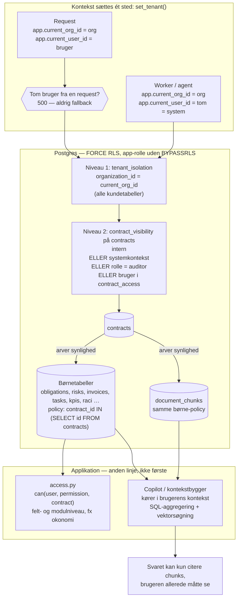
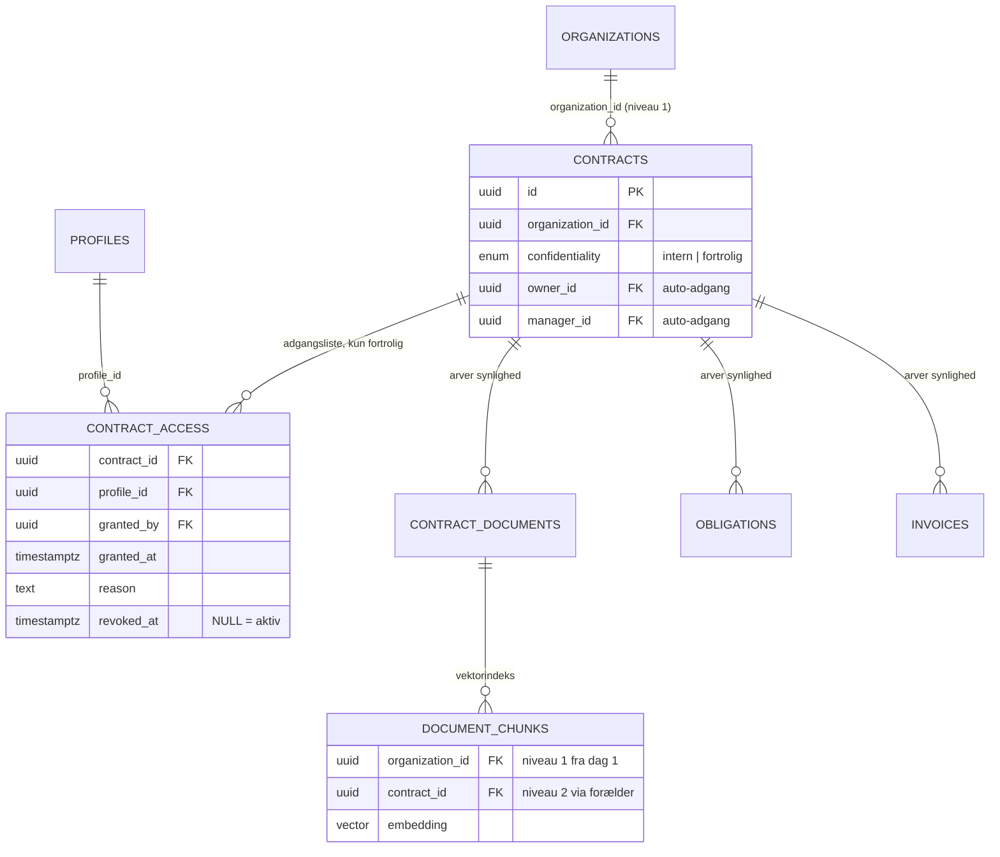

# ADR-0002: Tenant- og fortrolighedsgrænse — RLS på to niveauer

- **Status:** Accepted (2026-09-03)
- **Date:** 2026-09-03
- **Area:** auth-access
- **Deciders:** Project owner
- **Related:** ADR-0001 (kontrakten som aggregat); `docs/adr-plan.md` (N08, K06, K07);
  bidflow ADR-0004 (RLS som tenant-grænse), ADR-0074 (glem ikke afledte tabeller),
  ADR-0068 (superadmin); kommende ADR om RBAC-matrix (N07) og superadmin (K07)

## Kontekst

Bidflow beskytter **organisation mod organisation** med Postgres Row-Level Security
(ADR-0004): en `tenant_isolation`-policy på alle kundetabeller, sat via GUC'en
`app.current_org_id` pr. transaktion, `FORCE`'d så app-rollen ikke kan omgå den. Det
virker og er verificeret. Den lærdom, der kostede mest, var ADR-0074: motorens
vektortabel havde intet `organization_id` og blev derfor forældreløs ved GDPR-purge.

Obliance har den samme tenant-grænse **plus et niveau mere**, som bidflow aldrig
havde. Mockuppen viser fortrolighed *inde i* organisationen:

- Kontrakter er `Intern` eller `Fortrolig` (`fortrolighed`-feltet). Rammeaftalen om
  TNF-alfa-hæmmere med faste AIP-priser er `Fortrolig`; rengøringskontrakten er `Intern`.
- Rollematricen giver **Business User** næsten ingen tilladelser og holder økonomi
  (`okonomi`) væk fra Contract Manager, Procurement og Legal.
- Copiloten lover: *"søgningen er rettighedsfiltreret – AI kan aldrig hente indhold, du
  ikke selv har adgang til."* Det er et løfte om **retrieval**, ikke kun om UI.
- Administration siger: *"Tenant: amgros-prod · dataisolation pr. organisation"* og
  *"EU/EØS · kundedata anvendes ikke til AI-træning på tværs af kunder."*

Data, der skal beskyttes, er kommercielt følsomme (lægemiddelpriser, bodsberegninger,
leverandørperformance) hos en offentligt ejet indkøbsorganisation. Et læk fra én
Amgros-bruger til en anden er lige så alvorligt som et læk mellem to kunder — og det
mest sandsynlige lækagested er ikke en tabel, men **et AI-svar, der citerer et dokument,
brugeren ikke måtte se.**

Kravet er derfor: to grænser, begge håndhævet i databasen, begge gældende for
vektorsøgning og AI-kontekst — ikke kun for skærme.

## Beslutning

### Niveau 1 — tenant (org mod org): bidflow ADR-0004 uændret

- Alle kundetabeller bærer `organization_id`. **Også** `document_chunks` (vektorindekset),
  `audit_log`, `agent_runs`, `usage_events` og `ai_suggestions` — fra første migration,
  ikke som efterfølgende rettelse (jf. 0074).
- `tenant_isolation`-policy med `NULLIF(current_setting('app.current_org_id', true), '')::uuid`
  (0004's GUC-gotcha), `ENABLE` + `FORCE` RLS, app-rolle **uden** superuser/`BYPASSRLS`.
  CI opretter en ikke-superuser-rolle, ellers tester intet noget.
- Identitetstabeller (`profiles`, `organizations`, `organization_members`, `invitations`)
  er uden for policyen som i bidflow.
- Kontekst sættes ét sted (`set_tenant()` via `ContextVar` + `after_begin`-listener) i
  request-laget og i hvert job.

### Niveau 2 — fortrolighed (bruger mod bruger inden for org)

**Model.**

- `contracts.confidentiality ∈ {intern, fortrolig}` (ADR-0001).
  - `intern`: synlig for alle medlemmer af organisationen, hvis rolle overhovedet må se
    kontrakter (afgøres af RBAC-matricen, N07).
  - `fortrolig`: synlig **kun** for personer på kontraktens adgangsliste.
- Ny tabel **`contract_access`** `(contract_id, profile_id, granted_by, granted_at,
  reason, revoked_at)`. Ejer (`owner_id`) og manager (`manager_id`) får en post
  automatisk ved tildeling; alle andre tildeles eksplicit. Tildeling og tilbagekaldelse
  auditlogges.
- **Børn arver kontraktens klassifikation.** Dokumenter, forpligtelser, risici, fakturaer,
  KPI'er, opgaver, RACI og — afgørende — `document_chunks` har ingen egen klassifikation
  i v1; deres synlighed er kontraktens.

**Håndhævelse i databasen.** En anden GUC, `app.current_user_id`, sættes sammen med
tenanten. Oven på `tenant_isolation` får `contracts` policyen:

```sql
CREATE POLICY contract_visibility ON contracts FOR SELECT USING (
  confidentiality = 'intern'
  OR COALESCE(current_setting('app.current_user_id', true), '') = ''   -- systemkontekst, se nedenfor
  OR current_setting('app.current_role', true) = 'auditor'             -- Auditor læser alt, jf. afklaring 3
  OR EXISTS (
    SELECT 1 FROM contract_access a
    WHERE a.contract_id = contracts.id
      AND a.profile_id = NULLIF(current_setting('app.current_user_id', true), '')::uuid
      AND a.revoked_at IS NULL
  )
);
```

Alle **børnetabeller** får policyen `contract_id IN (SELECT id FROM contracts)`. Fordi
`contracts` selv er RLS-filtreret, arver børnene synligheden **uden at gentage reglen**
otte steder. Indeks på `contract_id` overalt. Det gælder også `document_chunks`, så en
vektorsøgning fysisk ikke kan returnere en chunk fra en fortrolig kontrakt, brugeren
ikke har adgang til — uanset hvad applikationskoden gør.

**Systemkontekst.** Tom/NULL `app.current_user_id` betyder *system* (agent- og
baggrundsjobs) og ser hele organisationen. Den må **kun** sættes i worker-processer,
aldrig fra en request. Agenternes output er forslag på en kontrakt og arver dens
klassifikation, så en agent kan ikke "vaske" fortroligt indhold ud til en bredere kreds.

**Håndhævelse i applikationen (anden linje, ikke første).**

- Ét modul, `app/access.py`, med `visible_contracts(user)` og `can(user, permission,
  contract)`. Alle læsestier bruger det; modul- og feltniveau (fx `okonomi`: må se
  fakturabeløb) håndhæves her efter RBAC-matricen (N07). Rækkeniveau er databasens
  ansvar; felt-/modulniveau er applikationens.
- **Copiloten og agenternes kontekstbygger kører altid i brugerens tenant + bruger-
  kontekst** — aldrig som servicerolle. Både vektoropslag og de strukturerede
  SQL-aggregeringer (K10) går gennem samme forbindelse med samme GUC'er. Der findes
  ingen "hent alt og filtrér bagefter"-sti.

**Superadmin (bidflow 0068).** Tenant-skift genbruges, men en superadmin ser som
udgangspunkt kun `intern`. Adgang til `fortrolig` kræver en eksplicit, tidsbegrænset
`contract_access`-post (break-glass), der auditlogges i **kundens** log. Detaljerne
hører i superadmin-ADR'en (K07); her fastlægges kun, at superadmin ikke omgår niveau 2.

**Test, der skal findes før release.** Kørt mod rigtig Postgres (RLS kan ikke testes på
SQLite):
1. Cross-org læsning returnerer 0 rækker; cross-org skrivning fejler på `WITH CHECK`.
2. En Business User uden `contract_access` ser ikke en `fortrolig` kontrakt — i
   listen, i detaljen, i søgningen **og i copilotens svar** (stil et spørgsmål, hvis svar
   kun kan findes i det fortrolige dokument; forvent "fremgår ikke af materialet").
3. Tilbagekaldt adgang (`revoked_at`) lukker med det samme, uden cache.
4. Systemkontekst fra en request afvises (guard i `set_tenant`).

## Diagram — håndhævelseskæden

Læses oppefra og ned: hvor konteksten sættes, hvilke policies den møder, og hvorfor
børnetabeller og vektorindeks arver synlighed uden egen regel. Den røde tråd er, at
copiloten aldrig kan citere en chunk, som databasen ikke allerede har vist brugeren.



Datamodellen bag niveau 2 er lille; erDiagrammet viser blot, at `contract_access` kun
hænger på `contracts`, og at `document_chunks` er et barn af kontrakten — ikke et
selvstændigt lager:



## Konsekvenser

- **To policies pr. børnetabel** (tenant + `contract_id IN (SELECT …)`), én subquery
  pr. forespørgsel. Ved denne skala (hundreder af kontrakter pr. org, ikke millioner)
  er det billigt; skulle det blive dyrt, er `contract_access` + `confidentiality` det
  eneste, der skal materialiseres.
- Løftet i copiloten bliver **sandt på databaseniveau**: en glemt filtrering i en
  prompt-bygger kan ikke lække en fortrolig chunk.
- `app.current_user_id` skal sættes på **alle** request-stier — glemmer man det, får
  brugeren systemkontekst. Derfor guard'en: i request-laget er tom bruger en fejl
  (500), ikke et fallback.
- Adgangslisten skal vedligeholdes: når ejer/manager skiftes, når nogen fratræder
  (bidflow 0067 — deaktivering, ikke sletning, så `contract_access`-historikken
  overlever). Responsibility Gap Agent får endnu en ting at rapportere: fortrolige
  kontrakter uden aktive adgangshavere.
- Dokumentniveau-klassifikation (et fortroligt bilag på en intern kontrakt) er **udskudt**.
  Løsningen i v1 er at klassificere hele kontrakten som fortrolig. Kommer behovet, er
  det en ny kolonne på `contract_documents` + samme policy-mønster — ikke en omskrivning.
- Afdelingsbaseret synlighed (`afdeling` på kontrakten, ingen afdeling på brugeren i
  mockuppen) er **ikke** en adgangsregel i v1; eksplicitte tildelinger dækker behovet.
- Superadmin-ADR'en (K07) og RBAC-ADR'en (N07) bygger direkte på denne.

## Alternativer overvejet

- **Kun applikationsfiltrering for niveau 2** (RLS kun for tenant). Afvist: præcis
  det sted, hvor lækagen er mest sandsynlig (AI-kontekstbyggeren), ville hvile på, at
  ingen udvikler nogensinde glemmer et filter. 0004's argument gælder uændret ét niveau
  ned.
- **Hele RBAC-matricen i RLS-policies** (rolle, `okonomi`, beløbsgrænser). Afvist:
  felt- og modulniveau er ikke rækkeniveau; policies bliver logik-tunge, svære at teste
  og skal alligevel spejles i Python til UI-beslutninger. Databasen svarer på *hvilke
  rækker*, applikationen på *hvilke felter og handlinger*.
- **Klassifikation pr. dokument fra dag 1.** Afvist for v1: mockuppen klassificerer
  kontrakten, og "hele kontrakten fortrolig" dækker de kendte cases. Udskudt, ikke
  fravalgt.
- **Schema-pr.-tenant.** Afvist som i 0004: tungere migrationer og forbindelses-
  håndtering, ingen gevinst ved denne skala, og løser ikke niveau 2.
- **Separat vektorlager uden RLS + filtrering i retrieval-laget.** Afvist: bryder
  "én database"-princippet (bidflow 0002) og genskaber 0074's forældreløse-chunks-
  problem — nu med fortroligt indhold.

## Afklaringer (2026-09-03, besluttet af project owner)

1. **Business User ser `intern`-kontrakter** (stamdata, forpligtelser, risici, opgaver)
   som udgangspunkt — blot uden økonomi, som RBAC-matricen (ADR-0003) styrer.
2. **Adgang til en fortrolig kontrakt tildeles af** kontraktens ejer, kontraktens manager
   og Systemadministrator. Legal & Compliance kan se tildelinger, men ikke tildele.
   Tilladelsen hedder `fortrolig_tildel` i ADR-0003.
3. **Auditor ser fortrolige kontrakter via rollen** (læs-only). Teknisk: policyen får et
   fjerde OR-led, `current_setting('app.current_role') = 'auditor'`, så Auditor ikke
   skal have `contract_access`-poster pr. kontrakt. Auditor-sessioner logges ved login
   og ved eksport, ikke pr. læsning.
