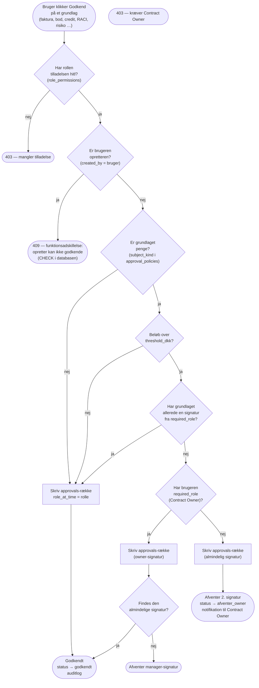

# ADR-0003: RBAC som data — rollematrix, funktionsadskillelse og beløbsgrænser

- **Status:** Accepted (2026-09-03)
- **Date:** 2026-09-03
- **Area:** auth-access
- **Deciders:** Project owner
- **Related:** ADR-0002 (rækkeniveau: tenant + fortrolighed — denne ADR er felt-,
  modul- og handlingsniveau); `docs/adr-plan.md` (N07, K13); bidflow ADR-0058 (stilling
  ≠ rolle), ADR-0066 (invitation med rolle), ADR-0067 (deaktivering); kommende ADR om
  HITL (N02) og bods-/creditberegning (N06)

## Kontekst

Bidflow havde fire roller (`admin`, `bid_manager`, …) og fire håndkodede gates
(go/no-go, udfald, GDPR-eksport, GDPR-sletning). Det rakte til et lille team på samme
side af bordet.

Mockuppens Administration → *Roller og rettigheder* viser noget andet: **8 roller × 9
tilladelser** som en matrix, plus to *systempolitikker*, der ikke er rolle-baserede:

| Rolle | kontraktRed | arkiver | hitl | okonomi | raciGodkend | brugere | agenter | eksport | audit |
|---|:-:|:-:|:-:|:-:|:-:|:-:|:-:|:-:|:-:|
| Systemadministrator | ✓ | ✓ | ✓ | ✓ | ✓ | ✓ | ✓ | ✓ | ✓ |
| Contract Manager | ✓ | ✓ | ✓ | – | ✓ | – | ✓ | ✓ | ✓ |
| Contract Owner | – | – | ✓ | ✓ | ✓ | – | – | ✓ | ✓ |
| Procurement Manager | ✓ | – | ✓ | – | – | – | – | ✓ | – |
| Legal & Compliance | – | – | ✓ | – | ✓ | – | – | ✓ | ✓ |
| Finance Controller | – | – | ✓ | ✓ | – | – | – | ✓ | – |
| Business User | – | – | – | – | – | – | – | – | – |
| Auditor | – | – | – | – | – | – | – | ✓ | ✓ |

Tilladelserne (mockuppens egne navne): *Oprette og redigere kontrakter · Arkivere
kontrakter · Godkende/afvise AI-forslag · Se og behandle økonomi og fakturaer · Godkende
RACI og governance · Administrere brugere og rettigheder · Konfigurere AI-agenter ·
Eksportere rapporter · Se fuld auditlog.*

Systempolitikkerne:

- **Godkendelsesgrænser:** "Bod og krav over 250.000 kr. kræver Contract Owner-godkendelse."
- **Funktionsadskillelse:** "Den, der opretter et grundlag, kan ikke selv godkende det."

Dertil kommer ADR-0002's afklaringer: Business User ser `intern`-kontrakter uden
økonomi; ejer/manager/Systemadministrator tildeler adgang til `fortrolig`; Auditor læser
alt via rollen. Og bidflow ADR-0058's skelnen: **stilling** ("Kontraktchef") er visning,
**rolle** er rettigheder — den holdes.

Ansvarsdelingen med ADR-0002 er præcis: databasen svarer på *hvilke rækker* en bruger
ser; denne ADR svarer på *hvilke felter, moduler og handlinger*.

## Beslutning

### 1. Én rolle pr. medlemskab, tilladelser som data

- `organization_members.role` er **præcis én** af de otte roller (enum `member_role`).
  Ingen multi-rolle i v1 — mockuppen har ét rollefelt, og funktionsadskillelse bliver
  uklar med flere.
- Ny tabel **`role_permissions (role, permission)`**, seedet fra matricen ovenfor.
  Tilladelserne er en enum `permission`, mockuppens ni plus tre, der følger af ADR-0002:
  `kontrakt_laes` (alle roller), `fortrolig_tildel` (Contract Owner, Contract Manager,
  Systemadministrator), `fortrolig_laes_alle` (kun Auditor).
- **Global matrix i v1.** Administration viser den read-only. Pr.-org-overstyring er
  ikke bygget, men modellen (data, ikke kode) gør det til en `organization_id`-kolonne
  senere — ikke en omskrivning.

### 2. Håndhævelse: server først, UI som spejl

- `app/access.py` (ADR-0002) udvides med `can(user, permission, contract=None)`. Alle
  muterende endpoints dekoreres `@require("hitl")` osv.; læse-endpoints, der eksponerer
  økonomifelter, filtrerer **felter i serialiseringen** — `okonomi = false` betyder, at
  `annual_value`, `budget`, fakturabeløb og bodsbeløb **ikke er i svaret**, ikke bare
  skjult på siden.
- `/me` returnerer brugerens effektive tilladelser, så UI'et kan skjule knapper. UI'et
  er aldrig den eneste gate.
- Rolleændring kræver `brugere`; en bruger kan **ikke ændre sin egen rolle** (invariant
  i endpointet) — ingen selv-eskalering. Rolleændringer auditlogges med før/efter.

### 3. Funktionsadskillelse som databaseinvariant

Alt, der kan godkendes (fakturaafvigelse, bodskrav, service credit, kreditnotakrav,
RACI-forslag, risiko, forpligtelse), har `created_by` og `approved_by`. Reglen er:

```sql
CHECK (approved_by IS NULL OR approved_by <> created_by)
```

- **AI-forslag** har `created_by = NULL` og `created_by_agent = '<agent>'`; ethvert
  menneske med `hitl` kan godkende dem — agenten er "den anden person".
- **Menneskeskabte grundlag** (fx en Finance Controller, der manuelt registrerer en
  afvigelse) kan ikke godkendes af samme person. Systemadministrator er **ikke** undtaget.
- Invarianten bor i databasen, fordi den skal holde uanset hvilken sti (API, CLI,
  fremtidig import) der skriver.

### 4. Beløbsgrænser som politik, ikke kode

Ny tabel **`approval_policies (organization_id, subject_kind, threshold_dkk,
required_role)`**, seedet pr. org med mockuppens regel:

| subject_kind | threshold_dkk | required_role |
|---|---:|---|
| `bod` | 250 000 | contract_owner |
| `service_credit` | 250 000 | contract_owner |
| `kreditnota_krav` | 250 000 | contract_owner |
| `faktura_afvisning` | 250 000 | contract_owner |

- Under grænsen: én godkendelse fra en rolle med `hitl` (typisk Contract Manager eller
  Finance Controller).
- **Over grænsen: to godkendelser** — den almindelige *plus* én fra `required_role`.
  Contract Owner erstatter ikke manageren; begge signaturer kræves. Funktionsadskillelse
  gælder begge (to forskellige personer, ingen af dem opretteren).
- Grænsen måles på **beløbet i kravet** (ikke kontraktens værdi), i DKK (ADR-0001).
- Forpligtelser, risici og RACI har **ingen** beløbsgrænse — de er ikke penge.
- Beløbet, der sammenlignes med, kommer fra den deterministiske beregning (N06),
  aldrig fra fritekst.

Godkendelser gemmes i **`approvals (subject_kind, subject_id, approved_by, role_at_time,
approved_at, comment)`** — én række pr. signatur — så et krav over grænsen har to rækker,
og auditloggen kan vise hvem, hvornår og i hvilken rolle.

## Diagram — godkendelsesflowet

Diagrammet viser processen, som matricen alene ikke gør: hvordan én godkendelses-
handling passerer tilladelse, funktionsadskillelse og beløbsgrænse i den rækkefølge —
og at grænsen tilføjer en signatur i stedet for at erstatte den.



Datadimensionen er lille (tre tabeller: `role_permissions`, `approval_policies`,
`approvals`) og er beskrevet fyldestgørende i prosa; et erDiagram ville gentage
tabellerne uden at vise noget nyt.

## Konsekvenser

- **Matricen kan ændres uden deploy** (den er data), men i v1 kun af operatøren via
  migration/CLI — ikke af kunden. Det er bevidst: rettighedsmodellen er en del af
  produktets governance-løfte, ikke en indstilling.
- **Økonomi-felter forsvinder fra API-svaret** for roller uden `okonomi`. Frontend-
  komponenter skal tåle manglende felter (ikke `undefined`-fejl). Én serializer-hjælper,
  `mask_financials(obj, user)`, ét sted.
- **To signaturer over grænsen** betyder, at et bodskrav kan stå i `afventer_owner` i
  dage. Deadline-motoren (N12) skal kende tilstanden, og Overblikket viser den som
  "kræver handling" for Contract Owner.
- Funktionsadskillelsen kan **blokere små organisationer**: hvis kun én person har
  `hitl`, kan de ikke godkende noget, de selv har oprettet. Det er korrekt adfærd
  (mockuppens politik), men onboarding skal advare: "mindst to personer med
  godkendelsesret".
- `Systemadministrator` har alle tilladelser, men er **underlagt** funktionsadskillelse
  og beløbsgrænser. Rollen er ikke break-glass; break-glass er superadmin-ADR'en (K07).
- Auditor's `fortrolig_laes_alle` sættes som GUC `app.current_role` i `set_tenant()`
  (ADR-0002) — det er den eneste tilladelse, databasen læser direkte.
- Tests, der skal findes: matrix-snapshot (enhver ændring i seed er en bevidst diff);
  selv-eskalering afvist; CHECK-invarianten rammer ved direkte SQL; over-grænse-krav
  kræver to rækker i `approvals` fra to forskellige personer; `okonomi = false` giver et
  svar uden beløbsfelter.

## Alternativer overvejet

- **Håndkodede gates pr. endpoint (bidflows model).** Afvist: 8 × 12 kombinationer i
  `if role in (...)` spredt over blueprints kan ikke revideres og drifter fra
  Administration-skærmen, der skal vise sandheden.
- **Fuld ABAC/policy-motor (OPA, Casbin).** Afvist for v1: én matrix + to politikker
  er for lidt til at retfærdiggøre en ekstern motor og dens sprog; modellen her er
  data og kan migreres til en motor, hvis reglerne vokser.
- **Flere roller pr. bruger.** Afvist: mockuppen har én; funktionsadskillelse og
  "rolle ved godkendelsestidspunkt" bliver tvetydige med flere.
- **Funktionsadskillelse kun i applikationslaget.** Afvist: reglen er en
  revisionsgaranti og skal holde for enhver skrivesti; en CHECK koster intet.
- **Beløbsgrænse som konstant i kode.** Afvist: 250.000 kr. er Amgros' tal; den næste
  kunde har et andet. Politik pr. org fra dag 1, seedet med default.
- **Contract Owner erstatter manageren over grænsen (én signatur).** Afvist: mockuppens
  formulering er "kræver Contract Owner-godkendelse" *oveni*; fire-øjne-princippet
  er pointen med grænsen.

## Afklaringer (2026-09-03, besluttet af project owner)

1. **`faktura_afvisning` er under beløbsgrænsen.** At stoppe en betaling har samme
   konsekvens for leverandøren som et krav; over 250.000 kr. kræves Contract Owner.
2. **Legal & Compliance har ikke `fortrolig_tildel`.** Fastholdt fra ADR-0002; Legal
   beder ejeren eller manageren.
3. **Mindst to personer med `hitl` er en advarsel, ikke en blokering.** Vises ved
   onboarding og i Administration, så en pilot med én person kan komme i gang.
