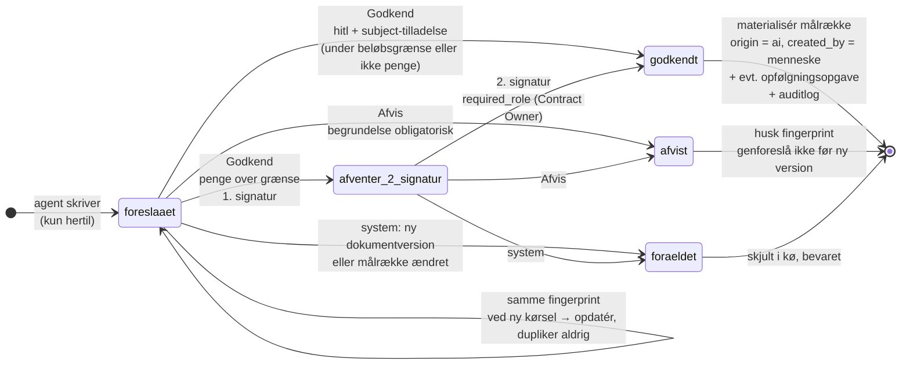

# ADR-0004: HITL som én mekanisme — AI skriver forslag, mennesker skriver registret

- **Status:** Accepted (2026-09-03)
- **Date:** 2026-09-03
- **Area:** ai-llm
- **Deciders:** Project owner
- **Related:** ADR-0001 (aggregatet og dets børn), ADR-0002 (forslag arver kontraktens
  synlighed), ADR-0003 (`hitl`-tilladelsen, funktionsadskillelse, `approvals`,
  beløbsgrænser); `docs/adr-plan.md` (N02, K11); bidflow ADR-0013 (guldsæt),
  ADR-0024 (fyld-kun merge), ADR-0018 (provenance pr. kørsel); kommende ADR'er om
  kildehenvisning (N04), dokumentversionering (N05), agentorkestrering (N03),
  bods-/creditberegning (N06)

## Kontekst

Mockuppens bærende løfte er *"AI foreslår — mennesket beslutter"*. Det er ikke én
feature; det er det samme mønster gentaget på tværs af skærme:

- **Forpligtelser:** `status: "AI-forslag"`, `sikkerhed: "Mellem"`, note "Udtrukket af
  Obligation Extraction Agent 27-08-2026. Sikkerhed: Mellem – frekvens er fortolket."
  Knapper: Godkend / Afvis.
- **Risici:** samme status og knapper; Risk Agent foreslår sandsynlighed, konsekvens og
  afværgehandling med kilde.
- **RACI:** "Foreslået af RACI Design Agent" med begrundelse og sikkerhedsniveau;
  godkendes af en rolle med `raciGodkend`.
- **Fakturaafvigelser:** `status: "Afventer kontrol"`, `sikkerhed`, `begrundelse`,
  `anbefaling` ("Afvis differencen og anmod om kreditnota på 18.560 kr.").
- **Contract Intake:** nye dokumenter → "Kontrakten er oprettet som kladde, og Contract
  Intake Agent er i gang med at læse dokumentet" → stamdata til godkendelse.
- **Ved godkendelse** sker der ting: auditpost ("AI-forslag godkendt"), og i flere
  tilfælde "– opfølgningsopgave oprettet".

Skærmen *Sådan arbejder AI'en* fastlægger de fem trin: datakilde → AI-agent analyserer
→ kontrol mod kontrakten (kildehenvisning) → **menneskelig godkendelse** → registrering
og auditlog. Systemprompten forbyder AI'en at godkende betalinger, opsige kontrakter og
afsende meddelelser.

Bidflows erfaring peger samme vej: guldsættet (ADR-0013) virkede, fordi hver
AI-kandidat kunne bekræftes eller afvises *uden* at motoren blandede sig i den
menneskelige dom; fyld-kun-merge (ADR-0024) virkede, fordi AI'en aldrig klobrede det,
et menneske havde skrevet.

Hvis mønstret implementeres pr. skærm — et `status`-felt her, en `afventer`-tilstand
der — får vi fire tilstandsmaskiner, fire audit-stier og fire steder, hvor
funktionsadskillelse og beløbsgrænser (ADR-0003) skal huskes. Kravet er én mekanisme.

## Beslutning

### 1. Én tabel: `ai_suggestions`

Agenter skriver **kun** hertil. Ingen agent har skriveadgang til `obligations`, `risks`,
`raci_entries`, `invoices`, `contracts` eller `tasks`.

| Kolonne | Betydning |
|---|---|
| `organization_id`, `contract_id` | RLS-niveau 1 og 2 (ADR-0002) — forslaget arver kontraktens synlighed |
| `agent_key`, `agent_run_id` | hvem og hvilken kørsel (provenance, jf. bidflow 0018) |
| `kind` | `create` (ny række) eller `update` (ændring af eksisterende) |
| `subject_kind` | `obligation · risk · raci_entry · invoice_finding · contract_intake · sla_breach · task` |
| `subject_id` | kun ved `update`: den række, der foreslås ændret |
| `payload` | JSONB: de foreslåede felter (ved `update` også `before`-snapshot til diff) |
| `confidence` | `hoej · mellem · lav` — sat af agenten, vist for brugeren |
| `rationale` | agentens begrundelse i klartekst ("frekvens er fortolket") |
| `citations` | JSONB-liste af kildehenvisninger (N04) — **tom liste er ikke tilladt** for `create` |
| `amount_dkk` | kun for pengeforslag; grundlaget for beløbsgrænsen (ADR-0003) |
| `fingerprint` | idempotensnøgle, se §4 |
| `status` | se tilstandsmaskinen nedenfor |
| `decided_by`, `decided_at`, `decision_comment` | den menneskelige dom |
| `materialized_id` | FK til den række, godkendelsen skabte/ændrede |

### 2. Tilstandsmaskinen

`foreslaaet → godkendt | afvist | foraeldet`, med én mellemtilstand
`afventer_2_signatur` for pengeforslag over beløbsgrænsen (ADR-0003).

- **Godkend** kræver `hitl` (ADR-0003) plus subject-specifik tilladelse: `raci_entry` →
  `raciGodkend`; `invoice_finding`, `sla_breach` → `okonomi`; `contract_intake` →
  `kontraktRed`. Funktionsadskillelse gælder trivielt (`created_by = NULL`, agenten er
  "den anden"); over grænsen kræves to signaturer i `approvals`.
- **Afvis** kræver samme tilladelse og en **obligatorisk begrundelse** (kort). Den er
  audit-sporet *og* det signal, guldsæt-disciplinen (bidflow 0013/0014) måler agenten på.
- **Forældet** sættes af systemet, aldrig af et menneske: når kontraktens gældende
  dokumentversion skifter (N05), eller når rækken et `update` peger på er slettet/ændret
  af et menneske siden forslaget. Forældede forslag vises ikke i køen, men beholdes.

### 3. Godkendelse materialiserer — i ét servicekald

`approve(suggestion, user, comment)` gør, i én transaktion:

1. Tjekker tilladelse og beløbsgrænse (ADR-0003); skriver `approvals`-række.
2. Ved fuld godkendelse: **opretter eller opdaterer målrækken** med `origin = 'ai'`,
   `suggestion_id` tilbage-reference, `created_by = user` (mennesket, der godkendte, ejer
   nu rækken — ikke agenten). Ved `update` anvendes fyld-kun/element-vis merge
   (bidflow 0024): felter, et menneske har ændret siden `before`-snapshottet, røres ikke,
   og forslaget markeres "delvist anvendt" i `decision_comment`.
3. Opretter en **opfølgningsopgave**, hvis `payload.followup_task` findes (mockuppens
   "– opfølgningsopgave oprettet"), med `origin` pegende på målrækken.
4. Skriver to auditposter: agentens oprindelige "AI-forslag oprettet" findes allerede;
   nu "AI-forslag godkendt" (bruger, objekt, beløb hvis relevant).

Målrækkerne har derfor **ingen** `AI-forslag`-status. Listerne i UI'et viser
`ai_suggestions` **unioned ind** med det visuelle "AI"-mærke (mockuppens violette
badge) — registret forbliver rent.

### 4. Idempotens og hukommelse

`fingerprint = sha256(agent_key, contract_id, subject_kind, normaliseret nøgle)` — hvor
nøglen er fx `(citation.dokument, citation.punkt, normaliseret titel)` for en
forpligtelse, `(fakturanr, linje)` for en fakturaafvigelse. Reglerne:

- En agentkørsel, der producerer et fingerprint, som allerede findes i `foreslaaet` eller
  `afventer_2_signatur`, **opdaterer** det eksisterende forslag (ny `agent_run_id`,
  evt. ny confidence) — dupliker aldrig.
- Et fingerprint, der er `afvist`, **genforeslås ikke** før kontraktens gældende
  dokumentversion skifter. Systemet nager ikke.
- Et fingerprint, der er `godkendt`, genforeslås ikke; agenten kan derimod foreslå et
  `update` på den materialiserede række.

### 5. Hvad der *ikke* er et forslag

- **Afledte fakta:** KPI-status beregnet af mål og måling, næste deadline, forbrug pr.
  år. De er visninger (ADR-0001), ikke beslutninger — ingen HITL.
- **Notifikationer:** systemet sender dem (N12); de ændrer intet register.
- **Copilotens svar:** tekst til brugeren, ikke en skrivning. Vil brugeren gemme noget
  fra et svar (et udkast til påkrav), bliver *det* et forslag af `subject_kind: task`
  eller et dokument — med brugeren som opretter, ikke AI'en.
- **Beregninger af beløb:** agenten foreslår *parametrene* (N06); beløbet i
  `amount_dkk` kommer fra den deterministiske beregning, aldrig fra modellen.

## Diagram — forslagets livscyklus

Beslutningen har en tydelig **procesdimension**: én tilstandsmaskine, som fire skærme
deler. Et tilstandsdiagram viser den kortere end prosa — især at kun *systemet* kan
forælde et forslag, og at pengeforslag har én tilstand mere.

Datadimensionen er én tabel og to fremmednøgler; et erDiagram ville ikke vise andet end
tabellen i §1.

## Konsekvenser

- **"AI skriver aldrig direkte i registret" er nu en databaserettighed**, ikke en
  kodekonvention: worker-rollen har INSERT/UPDATE på `ai_suggestions` og `agent_runs`,
  og *kun* SELECT på resten. En agent, der prøver at skrive en forpligtelse direkte,
  fejler.
- **Én kø, én skærm.** "Kræver handling" på Overblikket er `ai_suggestions WHERE status IN
  ('foreslaaet','afventer_2_signatur')` filtreret af brugerens tilladelser — ikke fire
  forskellige forespørgsler.
- **Listevisninger bliver unions** (målrækker ∪ forslag). Det er lidt mere frontend-
  logik, men registret forbliver rent, og eksporter (N20) indeholder aldrig ubesluttede
  forslag medmindre man beder om det.
- **Afvisningsbegrundelser er guld.** De er datagrundlaget for at måle agenterne
  (precision pr. agent, pr. confidence-niveau) og for tærsklerne i K11 — uden dem er
  "Sikkerhed: Mellem" et gæt, der aldrig kalibreres.
- **Forældelse kræver, at N05 (dokumentversionering) ved, hvem den skal vække:** et
  versionsskift kalder `expire_suggestions(contract_id)`. Rækkefølgen i ADR-planen
  holder (N04+N05 er næste).
- `update`-forslag med fyld-kun-merge betyder, at et menneskes rettelse altid vinder
  over agentens forslag — også når forslaget er godkendt *efter* rettelsen. Det er
  bidflow 0024's regel, og den er bevidst.
- Tests, der skal findes: worker-rollen kan ikke skrive i målregistre; samme fingerprint
  to gange giver én række; afvist fingerprint genforeslås ikke i samme version, men
  gør i næste; godkendelse over grænsen ender i `afventer_2_signatur` og ikke i
  registret; afvisning uden begrundelse afvises; `update` rører ikke menneskeligt
  ændrede felter.

## Alternativer overvejet

- **Status-felt `ai_forslag` på hver måltabel (mockuppens bogstavelige datamodel).**
  Afvist: fire tilstandsmaskiner, agenter med skriveadgang til registret, og
  "kræver handling" som fire forespørgsler. Mockuppen viser *UI'et*; den viser ikke
  tabellerne.
- **Agenten skriver målrækken direkte med `status = 'afventer'`, og godkendelse
  flipper status.** Afvist: bryder "AI skriver aldrig i registret" på databaseniveau
  og gør eksport/rapporter tvetydige (er en afventende risiko en risiko?).
- **Ingen idempotens — vis alt, lad mennesket rydde op.** Afvist: 12 natlige agenter ×
  uændrede dokumenter = samme forslag hver morgen. Køen ville dø af støj inden for en
  uge.
- **Auto-godkend ved `confidence = hoej`.** Afvist for v1: det er præcis det løfte,
  produktet *ikke* giver ("AI foreslår – mennesket beslutter"). Kan genovervejes pr.
  subject_kind, når afvisningsdata viser en målt precision — som en ny ADR med tal
  (bidflow 0014-disciplinen).
- **Valgfri afvisningsbegrundelse.** Afvist: uden den kan agenterne ikke kalibreres,
  og revisionen kan ikke se, hvorfor et AI-fund blev forkastet.

## Afklaringer (2026-09-03, besluttet af project owner)

1. **Bulk-godkendelse tilladt** for ikke-pengeforslag med `confidence = hoej`, maks. 50
   ad gangen, hver med egen `approvals`-række og auditpost. Pengeforslag altid enkeltvis.
2. **Godkendelse af Contract Intake-forslaget er `kladde → aktiv`** for kontrakten — én
   handling. Afvisning lader kontrakten stå som kladde med tomme felter til manuel
   udfyldning.
3. **Ubesluttede forslag over 14 dage eskaleres som notifikation** (N12) til
   kontraktens ejer. Status forbliver `foreslaaet`.

## Implementeringsnote (2026-09-04, første increment)

Bygget i migration `0004_ai_layer` og `backend/app/ai/suggestions.py`: tabellen fra §1
(partielt unikt indeks på `fingerprint` for åbne forslag, så en genkørsel opdaterer
og aldrig duplikerer), tilstandsmaskinen fra §2 (`approve` kræver `hitl` + subject-
tilladelsen; `reject` afviser uden begrundelse; `expire_for_version` sættes kun af
systemet ved versionsskift), materialisering pr. `subject_kind` (§3) som registrering
i `MATERIALIZERS` — den første er `contract_intake` i `app/agents/contract_intake.py`
med fyld-kun-merge og `kladde → aktiv` (afklaring 2). Endnu ikke bygget: beløbsgrænser
og `afventer_2_signatur` (approve afviser pengeforslag indtil ADR-0003's flow findes)
og 14-dages-eskalering (afklaring 3, venter på ADR-0017).

**Andet increment (2026-09-04):** første `create`-forslag — Obligation Extraction Agent
skriver ét forslag pr. forpligtelse med fingerprint på (dokument, punkt eller side, part,
normaliseret titel); godkendelse materialiserer en `obligations`-række med `origin = ai`
og det godkendende menneske som `created_by`/`approved_by`, plus `citations`-rækker.
Bulk-godkendelse (afklaring 1) findes som `POST /api/suggestions/bulk-approve`: kun
forslag uden beløb og med `hoej`, højst 50, hver med egen auditpost. Forpligtelser-
skærmen viser registret og de åbne forslag som én liste med AI-mærke.

**Tredje increment (2026-09-04):** Risk Agent (subject `risk`) følger samme mønster:
`create`-forslag med citat, fingerprint på (dokument, punkt eller side, kategori),
materialisering til `risks` med `origin = ai`; sandsynlighed og konsekvens er modellens
vurdering, mens score og niveau beregnes i kode ved læsning (ADR-0001). Kørselsløkken
er fælles for de tre dokumentdrevne agenter (`app/agents/runtime.py`), og alle tre
kører i rækkefølge ved et versionsskift. Gate G-07 (ADR-0023) er nu en test: worker-
rollen har ingen skriverettigheder på `contracts`, `obligations`, `risks` eller
`citations`.

