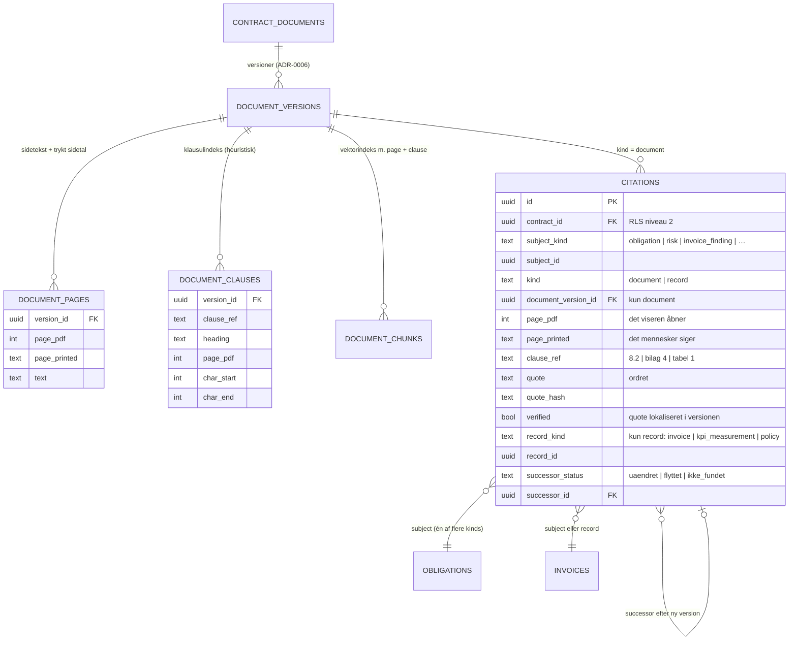

# ADR-0005: Kildehenvisning på klausulniveau — citatet er sandheden, siden er afledt

- **Status:** Accepted (2026-09-03)
- **Date:** 2026-09-03
- **Area:** documents
- **Deciders:** Project owner
- **Related:** ADR-0004 (`citations` på forslag; tom liste ikke tilladt), ADR-0006
  (dokumentversioner — en kilde peger på en version); `docs/adr-plan.md` (N04);
  bidflow ADR-0048 (PDF med markeret citat), ADR-0055 (lokalisér citatet, stol ikke på
  sidetal), ADR-0059 (reference-chips), ADR-0061 (opløs PDF-side ved ingest), ADR-0062
  (trykte sidetal), ADR-0049 (dokument → PDF)

## Kontekst

Alt i mockuppen, der har vægt, bærer et `kilde`-felt. Formerne er:

| Eksempel fra mockuppen | Hvad det peger på |
|---|---|
| `Hovedkontrakt, s. 12, pkt. 8.2` | dokument + side + **punkt** |
| `DBA, s. 6, pkt. 5` | databehandleraftalen, side, punkt |
| `Bilag 5, s. 2, tabel 1` | bilag, side, **tabel** |
| `Rammeaftale, bilag 4` | dokument uden side (hele bilaget) |
| `Prisbilag, s. 2, tabel 1` | prisbilag → grundlaget for et kreditnotakrav på 96.512 kr. |
| `Forbrugsdata, økonomimodul` | **ikke et dokument** — en systempost |
| `Governance-model N1` | en politik, ikke et dokument |

Dokumenterne har `uddrag[]` = `{ref, tekst}`: den citerede **tekst** følger altid med.
Kildehenvisningen er det, der gør bodsberegninger, fakturaafvisninger og påkrav
forsvarlige over for leverandøren — "jf. rammeaftalens pkt. 6.2" er ikke pynt, det er
retsgrundlaget.

Bidflow lærte fire ting, der overføres uændret: (1) sidetal fra konverterede DOCX/XLSX
er upålidelige — **lokalisér citatet i teksten** (0055); (2) gør det **én gang ved
ingest** og gem resultatet, ikke pr. visning (0061); (3) dokumentets **trykte** sidetal
er det, mennesker bruger (0062); (4) ét fund kan pege på **flere fragmenter** (0059).
Det nye er punkt- og tabelnummeret — bidflow citerede kun side.

## Beslutning

### 1. Citation er et struktureret objekt, aldrig en streng

Tabel **`citations`** (RLS-niveau 1+2 via `contract_id`, ADR-0002), polymorf ejer:

| Kolonne | Betydning |
|---|---|
| `subject_kind`, `subject_id` | hvad kilden underbygger (obligation, risk, invoice_finding, sla_breach, kpi, raci_entry …) |
| `kind` | `document` eller `record` |
| `document_version_id` | (document) den **version**, citatet er fundet i — ADR-0006 |
| `page_pdf` | (document) 1-baseret side i den renderede PDF — det, viseren åbner |
| `page_printed` | (document) dokumentets eget sidetal, hvis det findes (0062) — det, mennesker siger |
| `clause_ref` | (document) `"8.2"`, `"14.3"`, `"bilag 4"`, `"tabel 1"` — normaliseret label |
| `quote` | (document) den citerede tekst, ordret |
| `quote_hash` | normaliseret hash af `quote` (whitespace/case-uafhængig) |
| `verified` | (document) `true` hvis `quote` er lokaliseret i versionens tekst |
| `record_kind`, `record_id` | (record) fx `invoice/10493`, `kpi_measurement/…`, `policy/approval_policies` |
| `label` | **afledt, ikke redigérbar**: `"Hovedkontrakt · s. 12 · pkt. 8.2"` — genereres af dokumentets korte navn + `page_printed ?? page_pdf` + `clause_ref` |

Én række pr. fragment; et fund med tre kilder har tre rækker (0059-chips).

I `ai_suggestions.citations` (ADR-0004) ligger samme objekt som JSONB; ved godkendelse
materialiseres de til `citations`-rækker på målrækken.

### 2. Ankre opløses én gang ved ingest (ADR-0006's pipeline)

Når en dokumentversion ingestes:

1. **Sidetekst** pr. PDF-side gemmes i `document_pages (version_id, page_pdf, page_printed,
   text)`. `page_printed` udledes af sidehoved/-fod (0062), nullable.
2. **Klausulindeks** i `document_clauses (version_id, clause_ref, heading, page_pdf,
   char_start, char_end)` — heuristisk parsing af nummererede overskrifter
   (`^\d+(\.\d+)*\s`, `Bilag \d+`, `Tabel \d+`, `§ \d+`). Best-effort: nul fund er
   tilladt (dokumentet er så kun side-citerbart), fejl vælter aldrig ingest (bidflow
   0054-princippet).
3. **Chunks** til vektorindekset (ADR-0002) bærer `page_pdf` og nærmeste `clause_ref`,
   så en agent, der finder noget i en chunk, får ankeret gratis.

### 3. Citatet verificeres — sidetallet stoles der ikke på

Når en agent (eller et menneske) afleverer en citation med `quote`:

- **Lokalisér** `quote` i `document_pages.text` for den angivne version — normaliseret,
  whitespace-tolerant, med bidflow 0055's fallback på ord-overlap pr. side ved
  omskrevne citater. Fundet side **overskriver** agentens påståede side; `clause_ref`
  udledes af `document_clauses` for positionen (agentens eget forslag bruges kun, hvis
  indekset er tomt).
- Fundet → `verified = true`. Ikke fundet → `verified = false`, og på et AI-forslag
  **caps `confidence` til `lav`** og vises med advarsel ("citatet kunne ikke findes i
  dokumentet"). Et menneske kan stadig godkende — det kan se dokumentet — men aldrig
  uden at have set advarslen.
- En `create`-suggestion for dokumentafledte kinds (`obligation`, `risk`,
  `invoice_finding` mod prisbilag) **skal** have mindst én citation (ADR-0004);
  verificeret eller ej.

### 4. Visning: ét chip, ét klik

Chip'en viser `label`. Klik åbner PDF-viseren (bidflow 0048, pdf.js) på `page_pdf` med
`quote` fremhævet; kan filen ikke renderes, vises sideteksten med citatet markeret
(0055-fallback). `record`-citations linker til systemposten (fakturaen, målingen,
politikken) i stedet for en PDF.

### 5. Når dokumentversionen skifter

Citations peger på en **version** og omskrives aldrig. Ved ny gældende version (ADR-0006)
kører en **re-opløsning**: hvert `quote` på kontraktens aktive fund lokaliseres i den
nye version og får et **`successor`**-resultat gemt på citationen:

| `successor_status` | Betydning | Følge |
|---|---|---|
| `uaendret` | fundet på samme side/punkt | intet |
| `flyttet` | fundet, men andet sidetal/punkt | ny citation-række oprettes mod ny version; gammel beholdes som historik |
| `ikke_fundet` | citatet findes ikke i den nye version | fundet markeres "kilde forældet"; ADR-0004's `expire_suggestions` + en opgave til manageren: "Forpligtelse F-102's grundlag (pkt. 14.3) findes ikke i version 2.0" |

Det er sådan, systemet opdager, at en klausul er forhandlet væk — uden en LLM.

## Diagram — datamodellen bag en kildehenvisning

Beslutningen har en **datadimension**, der er svær i prosa: én citation peger på en
*version* (ikke et dokument), lånes af ankre fra to indeks (sider, klausuler), og kan
tilhøre både et forslag og en materialiseret række. Et erDiagram viser det i ét blik.
Ingen procesdimension her — pipelinen, der fylder tabellerne, er ADR-0006's diagram.

## Konsekvenser

- **Bodsberegninger og fakturaafvisninger kan altid vise deres retsgrundlag** som et
  klik — det er forudsætningen for N06 og for ethvert påkrav, copiloten udkaster.
- **Hallucinerede kilder er synlige.** En agent kan ikke stille et fund med en kilde,
  der ikke findes, uden at det bliver til `verified = false` + advarsel + capped
  confidence. Det er den vigtigste enkeltmekanisme mod at stole forkert på AI'en.
- Ingest bliver tungere: sidetekst, klausulindeks og chunks pr. version. Ved denne
  skala (hundreder af dokumenter, ikke millioner) er det minutter, ikke timer, og det
  sker i worker (N03).
- Klausul-parsing er **heuristisk** og vil fejle på nogle dokumenter (scannede
  kontrakter uden struktur, engelske templates). Konsekvensen er graciøs: citationen
  har side men intet punkt; `label` viser bare "s. 12". Kvaliteten måles — andel
  citations med `clause_ref` — og forbedres med regler, ikke med en model, indtil
  tallene siger noget andet.
- `label` er afledt, så et dokument, der omdøbes, får rigtige labels overalt uden
  opdatering.
- Re-opløsning ved versionsskift er det, der gør ADR-0004's `foraeldet` **præcis**
  (kun fund, hvis grundlag faktisk er væk) i stedet for grov (alt forældes).
- Tests, der skal findes: citat i konverteret DOCX lander på rigtig PDF-side (0055/
  0061-regressionen); omskrevet citat finder siden via overlap; ukendt citat giver
  `verified = false` og capper confidence; `label` ændres når dokumentet omdøbes;
  re-opløsning klassificerer `uaendret / flyttet / ikke_fundet` korrekt på en
  version, hvor ét punkt er slettet og ét flyttet.

## Alternativer overvejet

- **`kilde` som fritekst (mockuppens bogstavelige felt).** Afvist: kan ikke klikkes,
  verificeres, re-opløses eller tælles. Det er præcis det, bidflow måtte bygge sig ud af
  over fem ADR'er (0048–0062).
- **Kun side, intet punkt (bidflows model).** Afvist: leverandøren og juristen taler i
  punkter ("jf. pkt. 6.2"), ikke sider; og punktet overlever et versionsskift bedre end
  siden.
- **Klausul-parsing med LLM fra start.** Afvist for v1: nummererede overskrifter er
  regulære nok til regex; en model koster pr. dokument og introducerer netop den
  usikkerhed, kilden skal fjerne. LLM-fallback kan tilføjes, hvis målingen viser
  lav `clause_ref`-dækning — som ny ADR med tal.
- **Citations som JSONB på målrækken (ingen tabel).** Afvist: skal kunne forespørges
  på tværs ("alle fund med kilde i pkt. 14.3", "alle fund med `ikke_fundet`"), og
  re-opløsning skal kunne opdatere dem én ad gangen.
- **Omskriv citations ved ny version (peg på nyeste).** Afvist: ødelægger historikken
  og gør revisionens spørgsmål "hvad stod der, da I godkendte?" ubesvarligt.

## Afklaringer (2026-09-03, besluttet af project owner)

1. **Et menneske må godkende et forslag med `verified = false`** — med synlig advarsel
   og `confidence` capped til `lav`. Mennesket kan åbne dokumentet og dømme selv;
   OCR-støj må ikke blokere et rigtigt fund.
2. **`record`-citations linker direkte til systemposten** (fakturarækken, målingen,
   politikken). "Kilde: Forbrugsdata, økonomimodul" uden link er ikke en kilde.
3. **Klausul-heuristik er første og eneste trin i v1.** En LLM-fallback ved nul fund
   aktiveres først, når `clause_ref`-dækningen er målt — og som ny ADR med tal
   (bidflow 0014-disciplinen).
