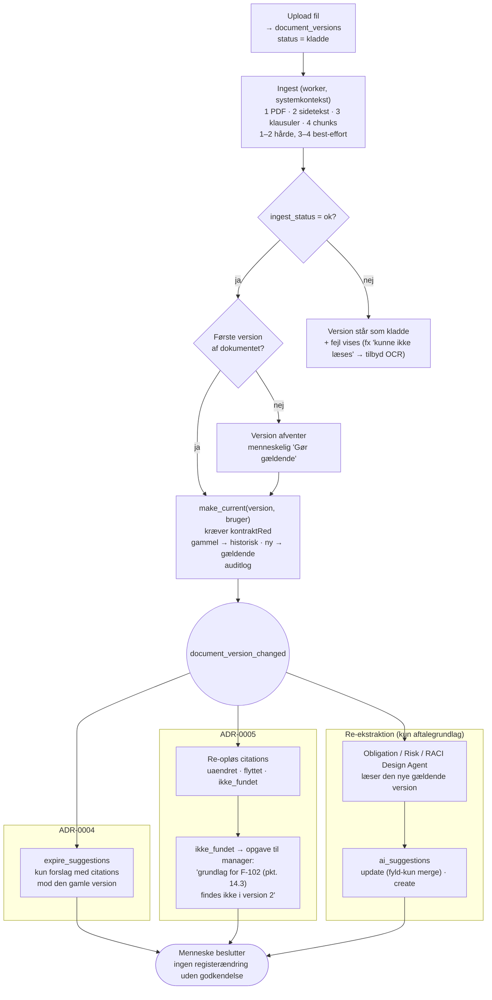

# ADR-0006: Dokumentversionering — uforanderlige versioner, én gældende ad gangen

- **Status:** Accepted (2026-09-03)
- **Date:** 2026-09-03
- **Area:** documents
- **Deciders:** Project owner
- **Related:** ADR-0001 (`contract_documents` som barn af kontrakten), ADR-0002
  (`document_chunks` arver synlighed), ADR-0004 (`expire_suggestions` ved versionsskift),
  ADR-0005 (citations peger på en version; re-opløsning); `docs/adr-plan.md` (N05);
  bidflow ADR-0007 (storage-facade), ADR-0024 (fyld-kun merge), ADR-0049 (dokument →
  PDF), ADR-0023 (OCR opt-in), ADR-0054 (gem primært output først); kommende ADR om
  opbevaring/legal hold (N10) og agentorkestrering (N03)

## Kontekst

Mockuppens dokumenter pr. kontrakt har `navn, type, version, gaeldende, uploadet, af`:

- `Hovedkontrakt_IT-drift_underskrevet.pdf` · Hovedkontrakt · 1.0 · gældende
- `Bilag_5_Service_credits.pdf` · Bilag · 1.0 · gældende
- `Driftsrapport_Q2_2026.pdf` · Rapport · 1.0 · gældende
- `Rammeaftale_TNF_delaftale1_underskrevet.pdf` · Hovedkontrakt; `Prisbilag`;
  `Leveringsrapport_juli_2026.pdf`
- DBA (databehandleraftale) citeres som selvstændigt dokument.

To ting følger af det: (1) et dokument har en **type** med forskellig karakter —
aftalegrundlag (hovedkontrakt, bilag, prisbilag, DBA, tillæg) versus dokumentation
(rapporter, korrespondance); (2) der er et begreb om **gældende**, som kun giver mening,
hvis der kan være flere versioner.

Alt det, der er bygget i ADR-0004 og 0005, hænger på versionen: forslag forældes,
citations re-opløses, chunks tilhører en version. Bidflow havde ingen versionering —
et dokument blev erstattet, og motoren kørte forfra (deraf 0054's crash på en
udskiftet række midt i en kørsel). Kravet er: en fil, der er uploadet, ændres aldrig; en
ny fil er en ny version; og systemet ved præcis, hvornår grundlaget skiftede.

## Beslutning

### 1. To tabeller: det logiske dokument og dets versioner

**`contract_documents`** (logisk dokument, barn af kontrakten, ADR-0001):
`contract_id`, `doc_type`, `title`, `current_version_id` (nullable indtil første version
er gjort gældende), `amends_document_id` (kun `tillaeg`: hvilket dokument det ændrer).

`doc_type ∈ { hovedkontrakt · bilag · prisbilag · databehandleraftale · tillaeg ·
rapport · korrespondance · andet }`. De fem første er **aftalegrundlag**; de tre sidste
er **dokumentation**. Forskellen bruges af copilot-kontekst og re-ekstraktion (§4), ikke
af datamodellen — begge typer versioneres ens.

**`document_versions`** (uforanderlige filer):
`document_id`, `version_no` (1, 2, 3 …; visningslabel "1.0" er kosmetik), `storage_key`,
`sha256`, `size_bytes`, `mime`, `uploaded_by`, `uploaded_at`, `status ∈ { kladde ·
gaeldende · historisk }`, `made_current_by`, `made_current_at`, `pdf_storage_key`
(bidflow 0049, lazy), `ingest_status ∈ { afventer · kører · ok · fejlet }`,
`ocr_applied` (bidflow 0023, opt-in), `effective_note` (fritekst: "gældende fra
1. april 2027 jf. tillæg 2").

**Invarianter:**
- **Præcis én `gaeldende` pr. dokument** — partial unique index på
  `(document_id) WHERE status = 'gaeldende'`.
- En version **slettes eller overskrives aldrig** (kun N10's opbevaringspolitik må
  fjerne noget, og det er en anden ADR). Storage-nøgle
  `{org}/{contract}/{document}/{version_no}/{filnavn}` — tenancy og version aflæselige
  af nøglen (bidflow 0007-mønstret).
- Samme `sha256` inden for samme dokument afvises som ny version ("filen er allerede
  version 2").

### 2. Ingest kører pr. version og skriver kun til versionens egne tabeller

Upload → `document_versions` (status `kladde`, `ingest_status = afventer`) → worker-job
(N03) i systemkontekst (ADR-0002):

1. Konvertér til PDF hvis nødvendigt (0049), gem `pdf_storage_key`.
2. Udtræk sidetekst → `document_pages`; scannet PDF uden tekstlag → markér
   "kunne ikke læses", tilbyd OCR pr. fil (0023) — ingen automatisk OCR.
3. Klausulindeks → `document_clauses` (ADR-0005 §2), best-effort.
4. Chunks + embeddings → `document_chunks` med `document_version_id` (ADR-0002/0005).
5. `ingest_status = ok`. Fejl i 3–4 sætter aldrig status til `fejlet`; kun 1–2 er
   hårde (bidflow 0054: gem det primære, resten er best-effort).

Ingest skriver **aldrig** til registret (forpligtelser, risici …). Det gør agenterne,
og kun som forslag (ADR-0004).

### 3. "Gør gældende" er en menneskelig handling — og et versionsskift er en hændelse

`make_current(version, user)` kræver `kontraktRed` (ADR-0003), `ingest_status = ok`, og
kører i én transaktion:

1. Tidligere gældende → `historisk`; denne → `gaeldende`; `contract_documents.
   current_version_id` opdateres. Auditlog: "Version 2 af Hovedkontrakt gjort gældende"
   (bruger, kontrakt, sha256).
2. Udsend hændelsen **`document_version_changed(contract_id, document_id, old, new)`**.
   Den har tre lyttere, alle asynkrone (N03):
   - **ADR-0004:** `expire_suggestions(contract_id)` — kun forslag, hvis citations peger
     på den gamle version, forældes; forslag på andre dokumenter rører den ikke.
   - **ADR-0005:** re-opløsning af alle aktive citations mod den gamle version →
     `uaendret / flyttet / ikke_fundet`; `ikke_fundet` opretter en opgave til manageren.
   - **Re-ekstraktion (§4).**

Den **første** version af et dokument gøres gældende automatisk ved vellykket ingest
(der er intet at afløse) — men stadig via samme funktion, så auditloggen er ens.

Agenter kan **ikke** gøre en version gældende. Contract Intake Agent kan foreslå
stamdata (ADR-0004), ikke skifte grundlag.

### 4. Re-ekstraktion mod det gældende aftalegrundlag

**Gældende aftalegrundlag** for en kontrakt = de gældende versioner af alle dokumenter
med `doc_type` i aftalegrundlag-gruppen. Det er den mængde, Obligation Extraction, Risk
og RACI Design Agent læser, og den mængde, copiloten grounder i som default.
Dokumentation (rapporter, korrespondance) læses af KPI/SLA-, Supplier Performance- og
Compliance-agenterne og er søgbar i copiloten, men er ikke "aftalen".

Efter et versionsskift på et aftalegrundlags-dokument kører ekstraktionsagenterne mod
den nye version og producerer **kun forslag**:

- Fund, hvis fingerprint (ADR-0004) matcher en eksisterende, godkendt række → `update`-
  forslag med `before`-snapshot; godkendelse anvender fyld-kun/element-vis merge
  (bidflow 0024): menneskets felter vinder.
- Nye fund → `create`-forslag.
- Rækker, hvis citations blev `ikke_fundet` i §3 → ingen automatisk sletning; opgaven
  fra ADR-0005 beder et menneske tage stilling (luk, omcitér, behold).

Ingen række i registret ændres af et versionsskift uden en menneskelig godkendelse.

### 5. Retrieval-filter

`document_chunks` for `historisk`-versioner beholdes (revision: "hvad stod der i v1?"),
men copiloten og agenterne søger som default kun i `gaeldende`. En eksplicit
"søg også i historiske versioner"-tilstand findes for revision og tvister; svaret
mærker da hver kilde med versionen.

## Diagram — hvad et versionsskift sætter i gang

Beslutningen har en **procesdimension**, der er sværere end datamodellen: én
menneskelig handling ("gør gældende") udløser tre asynkrone kæder, og alle tre ender i
menneskelige beslutninger, ikke i automatiske ændringer af registret. Datamodellen
(to tabeller) er dækket af ADR-0005's erDiagram.

## Konsekvenser

- **Revisionens spørgsmål kan besvares:** "hvad var grundlaget, da I godkendte?" — den
  version, citationen peger på, findes stadig, byte-identisk (`sha256`).
- **Et versionsskift er synligt, ikke stille.** Den gamle bidflow-adfærd (erstat filen,
  kør forfra) er umulig; det koster ét ekstra klik ("Gør gældende"), som er pointen.
- Storage vokser med hver version. Ved kontraktdokumenter (MB, ikke GB) er det
  ubetydeligt; N10 fastlægger, hvad der må ryddes og hvornår.
- **Tre asynkrone lyttere** på én hændelse betyder, at ingest og re-ekstraktion skal
  være idempotente og tåle genkørsel (N03). Hændelsen persisteres (outbox-mønster), så
  et worker-nedbrud ikke taber et versionsskift.
- Copilot-kontekst har nu et præcist begreb om "aftalen" (gældende aftalegrundlag) —
  det er det, K10's hybride kontekstbygger skal bruge, ikke "alle filer på kontrakten".
- Tillæg som selvstændigt dokument (`amends_document_id`) betyder, at hovedkontraktens
  version 1 forbliver gældende, mens tillæg 1 og 2 også er gældende. Copiloten skal
  vise begge som kilder; en "konsolideret" tekst genereres ikke i v1.
- Tests, der skal findes: to `gaeldende` på samme dokument afvises af indekset; samme
  sha256 afvises; `make_current` uden `kontraktRed` afvises; hændelsen udløser alle tre
  lyttere præcis én gang ved genkørsel; forslag på et *andet* dokument forældes ikke;
  chunks fra `historisk` er fraværende i default-retrieval og til stede i
  historik-tilstand.

## Alternativer overvejet

- **Én fil pr. dokument, overskriv ved upload (bidflows model).** Afvist: sletter
  grundlaget for godkendte fund og citations; umuliggør revision; var årsag til
  bidflow 0054.
- **Git-lignende automatisk "nyeste er gældende".** Afvist: hvornår en ny kontraktversion
  *gælder* er en juridisk vurdering (underskrift, ikrafttræden), ikke en upload-
  tidsstempel. Derfor er "gør gældende" en menneskelig handling med `kontraktRed`.
- **Fletning af tillæg ind i hovedkontrakten (konsolideret version).** Afvist for v1:
  konsolidering er juristarbejde med fortolkning; systemet viser i stedet begge kilder.
  En AI-genereret konsolideret læsning kan komme som copilot-funktion, aldrig som
  "dokument".
- **Kun aftalegrundlag versioneres; rapporter er flade filer.** Afvist: to filmodeller
  for ingen gevinst; en rapport, der genfremsendes rettet, er også en version.
- **Slet chunks for historiske versioner.** Afvist: revision og tvister har brug for
  "hvad stod der i v1"; filtreret som default er nok.

## Afklaringer (2026-09-03, besluttet af project owner)

1. **`make_current` kræver `kontraktRed`** (Contract Manager, Procurement Manager,
   Systemadministrator). Contract Owner har ikke `kontraktRed` i matricen (ADR-0003) og
   gør derfor ikke selv versioner gældende; ejeren ser skiftet i auditloggen og på
   Overblikket.
2. **Historiske versioner er søgbare i copiloten, men kun i en eksplicit
   historik-tilstand**, hvor hvert svar mærker kilden med versionsnummer. Aldrig blandet
   ind i default-retrieval.
3. **Tillæg er et selvstændigt dokument** (`doc_type = tillaeg` + `amends_document_id`),
   ikke en ny version af hovedkontrakten. Et tillæg supplerer; hovedkontraktens
   citations forbliver gyldige.
