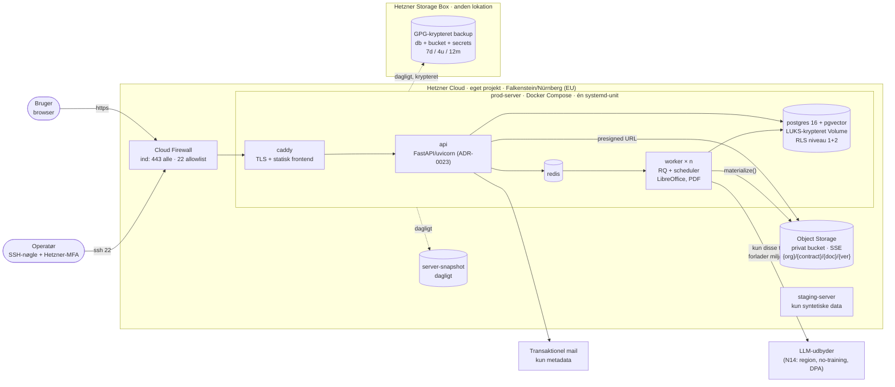

# ADR-0007: Dedikeret Hetzner-miljø i EU — multi-tenant SaaS, ingen delt host, objektstorage

- **Status:** Accepted (2026-09-03)
- **Date:** 2026-09-03
- **Area:** infra-ops
- **Deciders:** Project owner
- **Related:** ADR-0002 (multi-tenancy i databasen — ikke i infrastrukturen);
  `docs/adr-plan.md` (K01, N14); bidflow ADR-0019 (delt Hetzner-host, Cloudflare Tunnel),
  ADR-0083 (lokal disk), ADR-0084 (off-site krypteret backup), ADR-0007 (storage-facade),
  ADR-0026 (RQ-workers under systemd), ADR-0049 (LibreOffice på hosten), ADR-0070
  (admin-CLI bag SSH); kommende ADR om LLM-adgang og databehandling (N14),
  agentorkestrering (N03), opbevaring (N10)

## Kontekst

Beslutningsgrundlag fra project owner (2026-09-03): **produktet er en multi-tenant
SaaS**, og **det deployes på Hetzner**.

Mockuppens Administration lover kunden: *"Tenant: amgros-prod · dataisolation pr.
organisation"* og *"Dataopbevaring: EU/EØS · kundedata anvendes ikke til AI-træning på
tværs af kunder"*. Første kunde er en offentligt ejet indkøbsorganisation, hvis
sikkerhedsgennemgang vil spørge til: hvem deler maskinen, hvor ligger data, hvem kan
nå dem, hvordan krypteres de, hvordan gendannes de, og hvilke tredjeparter rører dem.

Bidflows produktion (ADR-0019) svarer dårligt på fire af de spørgsmål:

1. **Delt host** med to fremmede produktioner (Banedanmark, melo) — noisy neighbour,
   fælles blast radius, umulig at beskrive i en DPA.
2. **Lokal disk** som dokumentlager (0083) — durability hviler alene på backup.
3. **Vite dev-server** som frontend i prod — et udviklingsværktøj eksponeret offentligt.
4. **Cloudflare Tunnel** i datastien — ét ekstra amerikansk selskab, der terminerer TLS
   for kundens kontraktdata, uden at det er nødvendigt.

Det, der virkede i bidflow og skal med: systemd-superviserede processer (0026), GPG-
krypteret off-site backup med restore-test (0084), storage-facaden (0007), admin-CLI
bag SSH (0070), LibreOffice på hosten (0049).

Hetzner er et tysk selskab med datacentre i Falkenstein, Nürnberg (DE) og Helsinki (FI)
— alle EU. Hetzner Cloud tilbyder servere, persistente Volumes, S3-kompatibel Object
Storage, Cloud Firewall, private netværk og snapshots. Hetzner har **ingen managed
Postgres**; databasen er vores egen.

## Beslutning

### 1. Ét dedikeret Hetzner Cloud-projekt, kun Obliance

- Eget Hetzner Cloud-projekt (eget API-token, egne SSH-nøgler, eget netværk). **Ingen
  andre produkter på maskinerne.** Lokation **Falkenstein eller Nürnberg** (EU, DE) — ét
  valg, skrevet i `infra/README`.
- **To miljøer, to servere:** `prod` og `staging`, samme Compose-opsætning, forskellige
  størrelser. Staging kører **kun syntetiske/anonymiserede data** — aldrig en kopi af
  prod med rigtige kontrakter.
- **Multi-tenancy er databasens ansvar (ADR-0002), ikke infrastrukturens.** Alle
  kunder deler prod-serveren og databasen; RLS på to niveauer er grænsen. Ingen server
  pr. kunde. Tenant-id'et i Administration ("amgros-prod") er organisationens slug,
  ikke en maskine.

### 2. Topologi v1 — én applikationsserver, alt i Docker Compose

Én Hetzner Cloud-server (dedikeret vCPU-linje, fx `CCX23`/`CCX33`, 8–16 GB RAM — LLM-
kald er I/O, LibreOffice og PDF-rendering er CPU) med:

| Container | Rolle | Bemærkning |
|---|---|---|
| `caddy` | TLS (Let's Encrypt), reverse proxy, **serverer frontend som statisk build** | eneste container med port 443 udadtil |
| `api` | FastAPI/uvicorn *(fastlagt i ADR-0023; stod oprindeligt som Flask/gunicorn)* | intet `JOBS_SYNC`; ingen dev-server |
| `worker` | RQ-worker(e) + scheduler (N03) | skaleres som antal containere; LibreOffice og PDF-værktøjer i **dette** image, ikke i `api` |
| `redis` | kø + ratelimit-storage | ikke eksponeret |
| `postgres` | Postgres 16 + pgvector | data på **Hetzner Volume**, ikke root-disk; ikke eksponeret |

- **Hetzner Cloud Firewall:** indgående kun `443` (alle) og `22` (allowlist af
  operatør-IP'er). Alt andet lukket. Ingen Cloudflare Tunnel, ingen proxy i datastien
  — DNS må gerne ligge hos Cloudflare (DNS-only, grå sky).
- **Private netværk** mellem prod-serveren og fremtidige DB-/worker-servere fra dag 1,
  så et split senere ikke kræver re-adressering.
- **Kryptering at rest:** Volume til Postgres og evt. lokale filer er **LUKS-krypteret**
  (nøgle i password-manager + i `infra/` som krypteret hemmelighed, aldrig i klartekst).
  Hetzner Volumes er ikke krypterede af sig selv.
- Docker Compose som eneste procesdefinition. Ingen `uv venv` + systemd-units som i
  bidflow (det var en løsning på en delt host med forkert system-Python). Compose-
  stakken startes af én systemd-unit (`Restart=always`), så 0026's "overlever reboot og
  session" holder.

### 3. Dokumentlager: Hetzner Object Storage bag facaden

- Bidflow ADR-0007's storage-facade genbruges med en ny **`s3`-backend** mod **Hetzner
  Object Storage** (S3-kompatibel, samme EU-lokation). Én privat bucket pr. miljø;
  nøgler `{org}/{contract}/{document}/{version}/{filnavn}` (ADR-0006). Server-side
  encryption slået til. `signed_url` = presigned URL, 5 min.
- `materialize()` beholdes: worker henter til temp-fil for PDF/LibreOffice og rydder op.
- `local`-backend eksisterer stadig til dev/test/CI — **aldrig i prod**. 0083's valg
  overføres ikke.
- Hvis Object Storage viser sig utilstrækkelig (latency, limits) er fallback en
  **LUKS-krypteret Hetzner Volume** med `local`-backend — et config-skift, ingen kode.

### 4. Backup og DR — 0084 som krav, ikke som backfill

Dagligt, komplet, krypteret, off-site, restore-testet — fra første prod-deploy:

1. `pg_dump` (custom format) + spejling af Object Storage-bucket (`rclone sync`) +
   `.env`/secrets → tar → **GPG AES256** → **Hetzner Storage Box i en anden lokation**
   end serveren. Rotation: 7 daglige, 4 ugentlige, 12 månedlige.
2. **Hetzner server-snapshot** dagligt (hurtig gendannelse af hele maskinen; supplement,
   ikke erstatning — snapshot ligger samme sted som serveren).
3. **Restore-test hvert kvartal** ind i staging, dokumenteret i `infra/dr-log.md`.
4. **Overvågning af backup-friskhed** (0084's parkerede punkt er obligatorisk her):
   en check, der alarmerer, hvis seneste backup er > 30 timer gammel eller mindre end
   halvdelen af gårsdagens størrelse.
5. RPO: 24 timer. RTO: 4 timer (ny server + Volume fra backup + Compose up). Begge tal
   skrives i DPA'en.
6. Passphrase og LUKS-nøgle ligger i password-manager — **uden dem er backuppen
   værdiløs** (0084's kritiske lærdom).

### 5. Adgang og hærdning

- SSH: kun nøgler, ingen root-login, én deploy-bruger, `fail2ban`, `unattended-upgrades`.
  Operatørens egen konto har MFA hos Hetzner.
- Admin-CLI (bidflow 0070) kører i `api`-containeren via `docker compose exec` — stadig
  bag SSH, stadig ikke web-eksponeret.
- Secrets i én `.env` (600) på serveren + password-manager. Overgang til `sops`/`age`
  når mere end én operatør deployer.
- Logs: container-logs med rotation, samlet i `journald`. Uptime-check udefra (ekstern
  tjeneste, kun HTTP-status — ingen kundedata).

### 6. Hvad der forlader Hetzner

Præcis to udgående dataflows med kundedata, begge skal stå i DPA'en:

1. **LLM-udbyderen** (N14 fastlægger region, no-training-vilkår og databehandleraftale).
2. **E-mail** (notifikationer, invitationer) via en transaktionel mail-tjeneste —
   kun metadata (navn, frist, kontraktreference), aldrig dokumentindhold.

Ingen CDN, ingen analytics-tredjepart, ingen fejlrapportering med payloads i v1.

### 7. Skaleringssti (ikke bygget nu, men ikke blokeret)

Når én server ikke rækker: (a) flyt Postgres til egen server på det private netværk,
(b) tilføj worker-servere, (c) sæt en load balancer foran to `api`-noder. Object Storage
er allerede eksternt, så intet i (a)–(c) kræver datamigrering. Managed Postgres findes
ikke hos Hetzner; skulle det blive et krav, er et EU-managed alternativ (Aiven, Scaleway)
en datamigrering — ikke en omskrivning — fordi intet i stakken er Hetzner-specifikt ud
over Compose-hosten.

## Diagram — deployment-topologi

Beslutningen har en **strukturdimension**: hvad kører hvor, hvad er nået udefra, og
hvilke to pile forlader EU-miljøet. Det er det, en sikkerhedsgennemgang beder om som
det første, og et deployment-diagram viser det på ét ark. Ingen proces- eller
datadimension her.

## Konsekvenser

- **DPA'en kan skrives:** ét selskab hoster (Hetzner, DE), data ligger i EU, to
  navngivne udgående flows, kryptering at rest og in transit, RPO/RTO med tal.
- **Ingen naboer.** Blast radius er Obliance alene; en fejl i et andet produkt kan
  ikke tage kundens kontraktsystem ned.
- **Højere fast omkostning end bidflow** (dedikeret server + staging + Object Storage +
  Storage Box) — i størrelsesordenen et par hundrede euro om måneden. Det er prisen for
  at kunne sælge til offentlige kunder overhovedet.
- **Postgres er vores drift.** Opgraderinger, vacuum, pgvector-versioner og
  restore-tests er operatørens ansvar; der er ingen managed knap. Restore-testen hvert
  kvartal er derfor ikke valgfri.
- Frontend bygges i CI og serveres statisk — ingen `allowedHosts`-hacks, ingen
  dev-server i prod.
- Worker-imaget er tungt (LibreOffice). Det er bevidst adskilt fra `api`, så API'et
  starter hurtigt og kan skaleres uafhængigt.
- **Bidflow-ADR'er, der overføres:** 0007 (facade), 0026 (supervision, retry, timeouts),
  0070 (CLI), 0084 (backup-disciplin). **Ikke overført:** 0019 (delt host, tunnel,
  dev-server), 0083 (lokal disk).
- Tests/tjek, der skal findes før første kunde: restore fra Storage Box til en ren server
  ender med en app, der logger ind; firewall-scan udefra viser kun 443; presigned URL
  udløber efter 5 min; en `local`-backend i prod-config afvises ved opstart.

## Alternativer overvejet

- **Blive på den delte bidflow-host (0019).** Afvist: kan ikke beskrives i en DPA,
  og en offentlig kundes sikkerhedsgennemgang vil afvise det.
- **Server pr. kunde (single-tenant deploy).** Afvist: project owner har besluttet
  multi-tenant SaaS; RLS på to niveauer (ADR-0002) er isolationen. Kan tilbydes som
  premium-variant senere, fordi Compose-stakken er den samme.
- **Hyperscaler i EU (Azure West Europe, AWS eu-central-1).** Afvist på beslutningen
  "Hetzner"; ville give managed Postgres og objektstorage, men amerikansk moderselskab
  og CLOUD Act i gennemgangen. Bidflow 0007's Azure-argument var netop det modsatte —
  og blev aldrig brugt.
- **Cloudflare Tunnel/proxy foran (som bidflow).** Afvist for datastien: unødvendig
  tredjepart, der terminerer TLS for kontraktdata. Hetzner Firewall + Caddy giver
  samme resultat med én part mindre. Cloudflare som DNS-only er fint.
- **Hetzner Dedicated (bare metal) i stedet for Cloud.** Afvist for v1: dyrere,
  langsommere at provisionere, ingen Volumes/snapshots/firewall som service. Relevant
  ved stor skala.
- **Lokal disk på LUKS-Volume som primært lager (0083-variant).** Afvist som primær:
  Object Storage giver durability uafhængigt af serveren og gør server-udskiftning
  triviel. Beholdt som dokumenteret fallback.
- **Kubernetes.** Afvist: én server, fem containere; Compose er tilstrækkeligt og
  forståeligt for én operatør.

## Afklaringer (2026-09-03, besluttet af project owner)

1. **Cloudflare er ude af datastien.** Kun DNS (DNS-only, grå sky); Hetzner Cloud
   Firewall + Caddy er eneste indgang. Færrest tredjeparter i DPA'en; DDoS-risikoen for
   et login-beskyttet B2B-system er lav.
2. **Hetzner Object Storage er primært dokumentlager.** Serveren bliver udskiftelig, og
   backup bliver en bucket-spejling. LUKS-Volume + `local` er dokumenteret fallback.
3. **Staging kører udelukkende syntetiske eller anonymiserede data** — hård regel,
   skrevet i DPA'en. Ingen kopi af prod til fejlsøgning.
