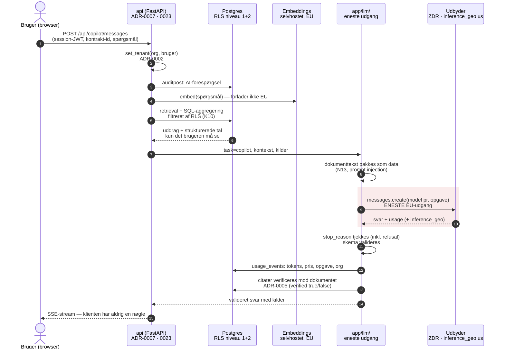

# ADR-0008: LLM-adgang — serverside proxy, dataresidens og databehandling

- **Status:** Accepted (2026-09-03)
- **Date:** 2026-09-03
- **Area:** ai-llm
- **Deciders:** Project owner
- **Related:** ADR-0002 (rettighedsfiltrering før modellen ser noget), ADR-0004 (AI
  skriver kun forslag), ADR-0005 (citater verificeres lokalt), ADR-0007 (hosting, de to
  udgående dataflows), ADR-0009 (model pr. opgave); `docs/adr-plan.md` (N14, K03);
  bidflow ADR-0035 (én kilde til modellens default), ADR-0051 (model-provenans
  dev-only), ADR-0082 (forbrug og omkostning); kommende ADR om AI-sikkerhed (N13)

## Kontekst

Mockuppen kalder `https://api.anthropic.com/v1/messages` **direkte fra browseren**, med
`model: "claude-sonnet-4-6"` hardkodet i klientkoden og uden auth-header. Som prototype
er det forståeligt; som arkitektur er det uholdbart på fem punkter: nøglen kan ikke
holdes hemmelig, rettighedsfiltreringen (ADR-0002) omgås, kaldet kan ikke auditeres,
forbruget kan ikke måles (bidflow ADR-0082 ville aldrig se det), og modelvalget kan
ikke styres centralt (bidflow ADR-0035's problem, nu i frontend).

Samtidig lover mockuppens Administration kunden to ting:

> **Dataopbevaring:** EU/EØS · kundedata anvendes ikke til AI-træning på tværs af kunder

Den anden halvdel kan holdes. Den første kan **ikke** holdes på den førsteparts Claude
API i dag. Verificeret 2026-09-03 mod Anthropics dokumentation:

- `inference_geo` accepterer **kun `"us"` og `"global"`** — der er ingen EU-værdi.
  *"Inference geo: Only `"us"` and `"global"` are available."*
- **Workspace geo** (hvor data lagres at rest og hvor endpoint-behandling sker) er
  *"`"us"` is the only available workspace geo"*, sættes ved oprettelse og kan ikke
  ændres.
- EU-behandling findes kun via **partner-platformene**: Google Vertex AI med
  `region="eu"`, eller Amazon Bedrock med en EU-inference-profil. Der er
  cloud-udbyderen databehandler, ikke Anthropic.

Til gengæld er retentions-siden stærk og dokumenteret:

- *"Retained data is never used for model training without your express permission."*
- *"Conversation content (your prompts and Claude's outputs) is not retained by default"*
  — undtagen Covered Models, der kræver 30 dages opbevaring.
- **Zero data retention (ZDR)** kan aftales pr. organisation: prompts og svar lagres
  slet ikke at rest efter svaret er returneret. Forbehold: flaggede sager kan opbevares
  i op til 2 år, og **CORS understøttes ikke for ZDR-organisationer** — browserkald er
  dermed også kontraktuelt udelukket, ikke kun teknisk uklogt.

Dertil en juridisk skelnen, der er værd at skrive ned, fordi den styrer hvor hårdt
kravet er: kontraktmaterialet indeholder **lidt personoplysninger** (kontaktpersoner,
medarbejdernavne i RACI, underskrivere) og **meget forretningsfortroligt** (faste
AIP-priser, bodsopgørelser, leverandørperformance). GDPR rammer det første; det andet er
kontraktuel fortrolighed og udbudsretlig følsomhed. Begge skal adresseres, men de har
forskellige løsninger.

## Beslutning

### 1. Al modeladgang går gennem egen backend. Ingen undtagelser.

- Én modul, `app/llm/`, er det **eneste** sted i kodebasen, der taler med en
  LLM-udbyder. API-nøgler lever kun i miljøet på serveren (ADR-0007's `.env`, 600),
  aldrig i et build-artefakt, aldrig i et svar til klienten.
- Frontend kalder **kun** vores egne endpoints (`POST /api/copilot/messages` osv.).
  En browser må aldrig have en udbydernøgle, og ingen udbyder-URL optræder i
  frontend-koden. En lint-regel/CI-tjek fejler bygget, hvis `api.anthropic.com`,
  `x-api-key` eller `ANTHROPIC_` optræder under `frontend/`.
- Copilot-svar streames fra vores backend til klienten (SSE), så brugeren stadig ser
  svaret løbende, uden at klienten rører udbyderen.

### 2. Hvert kald bærer tenant, bruger, formål og forbrug

`app/llm/` accepterer ikke en fri prompt. Indgangen er en **opgave** (ADR-0009's
`task`) plus en kontekst, og laget gør fire ting, som ingen kaldsted kan springe over:

1. **Kontekst hentes rettighedsfiltreret** i brugerens egen DB-kontekst (ADR-0002) —
   både vektoropslag og strukturerede aggregeringer. Dokumenttekst pakkes som data,
   aldrig som instruktioner (N13).
2. **Auditpost** skrives før kaldet: hvem spurgte, om hvilken kontrakt, hvilken opgave.
   Mockuppens `AI · Contract Copilot · AI-forespørgsel` er præcis den række.
3. **Forbrug måles** pr. operation (bidflow ADR-0082): `usage.input_tokens`,
   `output_tokens`, cache-læsninger, model, opgave, org, bruger → én `usage_events`-række
   pr. brugerhandling. Prisen slås op i en modeltabel i konfigurationen; vises i USD og
   DKK.
4. **Svaret valideres** før det bliver til et forslag (ADR-0004): strukturerede outputs
   for alt maskinlæsbart, og `stop_reason` tjekkes — inklusive `refusal` — før indholdet
   læses.

### 3. Dataresidens: to konfigurationer, én default, ét ærligt løfte

Residens er et **konfigurationsvalg pr. installation**, ikke en kodeantagelse.
`LLM_BACKEND` vælger:

| Backend | Behandler | Hvor kører inferens | Konsekvens |
|---|---|---|---|
| `anthropic` (**default**) | Anthropic | USA (`inference_geo: "us"`, 1,1× pris) eller globalt | Fuld feature-adgang: Batches (halv pris), Files API, prompt caching, citations. Kræver ZDR-aftale + SCC'er for tredjelandsoverførsel. |
| `vertex_eu` | Google Cloud | EU (`region="eu"`) | EU-inferens. Mister Batches, Files API og web-værktøjer. Google bliver databehandler. |

- **Default er `anthropic` med ZDR og `inference_geo: "us"`** — bevidst US-pin frem for
  `global`, fordi et præcist svar på "hvor kørte det?" er værd 10 % ekstra pris, og fordi
  `response.usage.inference_geo` så kan **logges pr. kald** som dokumentation.
- `vertex_eu` bygges som en reel, testet backend fra dag 1 (ikke et TODO), så en kunde,
  der kontraktuelt kræver EU-inferens, kan få det uden en kodeændring — prisen er de
  manglende features, og det skal stå i tilbuddet.
- **Alt andet end generering forbliver i EU:** dokumenter, database, vektorindeks,
  auditlog og backup ligger på Hetzner i EU (ADR-0007). Det er kun *promptens indhold*
  for det enkelte kald, der forlader EU på `anthropic`-backenden — og under ZDR lagres
  det ikke.
- **Embeddings forlader aldrig EU** (ADR-0009 §2: selvhostet model på worker'en). Det er
  vigtigt, fordi embeddings ellers ville sende *hele* dokumentbestanden ud, ikke kun de
  uddrag et enkelt spørgsmål kræver.

### 4. Mockuppens tekst skal rettes

Administration må ikke love mere, end stakken leverer. Teksten bliver, for
default-konfigurationen:

> **Dataopbevaring:** Dokumenter, database og backup i EU/EØS (Hetzner, Tyskland) ·
> AI-generering hos Anthropic uden lagring (zero data retention) · kundedata anvendes
> ikke til modeltræning
>
> Kunder med krav om EU-inferens kan få AI-behandlingen i EU (Google Cloud, EU-region).

Dette er en **produktbeslutning, ikke kun en tekstrettelse**: løftet er en del af det,
der sælges til en offentlig kunde, og det skal kunne dokumenteres i en DPA.

### 5. Databehandleraftale — hvad der skal foreligge før første kunde

- **Vores rolle:** Obliance er databehandler for kunden (som bidflow, ADR-0008).
  Anthropic/Google er **underdatabehandler**, og skal navngives i DPA'en med
  behandlingssted.
- **Tredjelandsoverførsel** (default-backenden): SCC'er + en dokumenteret
  overførselsvurdering. Om Anthropic er certificeret under EU-US Data Privacy Framework
  skal **verificeres hos udbyderen** før DPA'en underskrives — det er ikke antaget her.
- **Dataminimering som teknisk foranstaltning:** kun de uddrag, spørgsmålet kræver,
  sendes (ADR-0002's filtrering + top-k retrieval), aldrig hele kontraktbestanden.
- **Ingen browser-CORS** (ZDR-krav) er dermed også et kontraktuelt argument for §1.
- **Underdatabehandlerliste + underretningspligt** ved skift af LLM-udbyder skrives ind,
  fordi ADR-0009 gør et skift til et konfigurationsvalg.

## Diagram — vejen for ét copilot-svar

Beslutningen har en **procesdimension**, som prosaen har svært ved: rækkefølgen af
filtrering, audit, måling og validering omkring det ene kald, der forlader EU. Et
sekvensdiagram viser hvad der sker før og efter, og præcis hvor grænsen ligger.
ADR-0007's diagram viste topologien; dette viser ét kald gennem den.

## Konsekvenser

- **K03 er lukket:** ingen nøgle i browseren, og CI håndhæver det. Mockuppens kald kan
  ikke overleve ind i produktionen ved et uheld.
- **Løftet i Administration bliver sandt** — men det er et andet løfte, end mockuppen
  skrev. Det er den rigtige rækkefølge: rette teksten frem for at love EU-inferens, vi
  ikke kan levere på default-stakken.
- **1,1× pris for US-pin.** Bevidst: dokumenterbar residens pr. kald er værd mere end
  10 % på en post, der ikke er projektets største.
- **To backends betyder to testmatricer.** `vertex_eu` mangler Batches (nattens
  agentkørsler bliver dobbelt så dyre der) og Files API. Det skal prissættes i tilbuddet,
  ikke opdages senere.
- **ZDR skal aftales med udbyderen** (kontakt til salg), og den skal være på plads før
  første kundedata. Uden ZDR er default-konfigurationen ikke det, DPA'en beskriver.
- **Flaggede sager kan opbevares op til 2 år** trods ZDR. Det er en oplysning, der hører
  i DPA'en — ikke noget, vi kan aftale væk, og bedre nævnt end fundet.
- Alt AI-forbrug er målt fra første kald (bidflow ADR-0082's lærdom: opsamlingen blev
  aldrig bygget, så viewet var tomt i månedsvis). Her er målingen en del af
  kaldsstien, ikke et senere increment.
- Model-provenans (`model`, udbyder) logges altid i `agent_runs`/`usage_events`, men
  vises kun for udviklere (bidflow ADR-0051, jf. K09's skel: agent og sikkerhed er
  produktflade, model-id er ikke).
- Tests/tjek: CI fejler ved udbyder-URL eller nøglenavn under `frontend/`; et kald uden
  `set_tenant` afvises i `app/llm/`; `usage_events` får en række pr. copilot-svar og pr.
  agentkørsel; `stop_reason: refusal` håndteres uden at vise et tomt svar;
  `vertex_eu`-backenden svarer på samme kontrakt-testsuite som default.

## Alternativer overvejet

- **Browserkald som i mockuppen (K03).** Afvist på fem punkter, jf. Kontekst — og
  udelukket kontraktuelt af ZDR's manglende CORS-understøttelse.
- **`inference_geo: "global"` som default.** Afvist: billigere, men gør spørgsmålet
  "hvor blev vores kontrakt behandlet?" ubesvarligt. Vi vælger det svar, der kan skrives
  ned.
- **Amazon Bedrock med EU-inference-profil som EU-backend** frem for Vertex. Ligeværdig
  teknisk; valgt fra i første omgang, fordi ADR-0007 netop valgte Hetzner for at holde
  hyperscalerne ude af driften, og fordi Bedrock mangler flere features end Vertex
  (bl.a. web search). Kan tilføjes som tredje backend — abstraktionen er den samme.
- **Selvhostet open-weight model på Hetzner (fuld EU, ingen udbyder).** Afvist for v1:
  kvaliteten på dansk juridisk tekstforståelse og strukturerede udtræk er ikke i
  nærheden af det, forpligtelses-ekstraktion kræver, og GPU-drift ville dominere
  budgettet. Genovervejes hvis en kunde kræver ingen tredjepart overhovedet.
- **Anonymisering/pseudonymisering før afsendelse.** Afvist som løsning: det følsomme
  er ikke navnene, men priserne og vilkårene — dem kan man ikke maskere og stadig få et
  brugbart svar. Dataminimering (kun relevante uddrag) er den virksomme foranstaltning.
- **Vente med DPA-arbejdet til der er en kunde.** Afvist: løftet står i produktets UI
  allerede, og en offentlig kundes sikkerhedsgennemgang kommer før kontrakten, ikke
  efter.

## Afklaringer (2026-09-03, besluttet af project owner)

1. **Default-backend er `anthropic` med ZDR, og UI-teksten rettes** til det, stakken
   faktisk leverer (§4). `vertex_eu` bygges og testes som option og sælges til kunder,
   der kontraktuelt kræver EU-inferens — så alle kunder ikke betaler i manglende
   features for et krav, ikke alle har.
2. **`inference_geo: "us"` pinnes** (1,1× pris) frem for `global`, og
   `response.usage.inference_geo` logges pr. kald som dokumentation.
3. **Project owner ejer** verifikationen af udbyderens overførselsgrundlag
   (DPF-certificering eller SCC'er) og indgåelsen af ZDR-aftalen. Det er en
   **blokerende opgave inden pilotaftalen underskrives** og inden første kundedata —
   ikke en udviklingsopgave.

> **Forretnings- og juraforbehold.** Punkt 1 og 3 er registreret som beslutninger her,
> men de har konsekvenser uden for koden: et kundevendt løfte ændres, og et
> tredjelandsoverførselsgrundlag skal bekræftes hos udbyderen og holde over for Amgros'
> egen DPO og sikkerhedsgennemgang. Bekræft dem med juridisk rådgiver og med kunden,
> før DPA'en underskrives. Falder EU-inferens ud som et hårdt krav, er `vertex_eu`
> bygget og klar — det er præcis derfor, den er en del af beslutningen og ikke et TODO.
