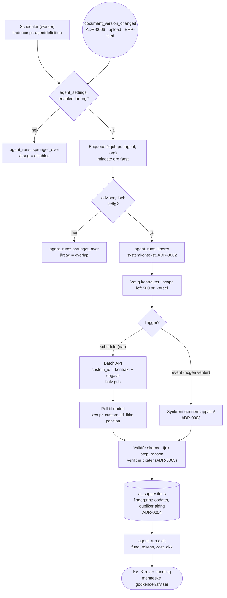

# ADR-0010: Agentorkestrering — planlagte kørsler, idempotens og ét kørselsspor

- **Status:** Accepted (2026-09-03)
- **Date:** 2026-09-03
- **Area:** infra-ops
- **Deciders:** Project owner
- **Related:** ADR-0002 (systemkontekst), ADR-0004 (agenter skriver kun forslag;
  fingerprint), ADR-0006 (`document_version_changed`), ADR-0007 (worker-container),
  ADR-0008 (al modeladgang gennem `app/llm/`), ADR-0009 (opgave → model, batch);
  `docs/adr-plan.md` (N03, K08); bidflow ADR-0018 (`pipeline_runs`), ADR-0026 (RQ i
  produktion: supervision, retry, timeouts), ADR-0011 (kø + planlagt oprydning),
  ADR-0054 (gem det primære først), ADR-0082 (forbrug pr. operation)

## Kontekst

Bidflows jobmodel er **brugerudløst**: nogen trykker på en knap for ét udbud, et job
kører, brugeren venter. ADR-0026 gjorde den model driftsklar (systemd-supervision,
`JOBS_SYNC=0`, retry, timeout 600 → 5400) efter en produktionshændelse.

Mockuppen beskriver noget andet. AI-agenter-skærmen viser pr. agent: `status: Aktiv |
Pauset`, `sidst: 30-08-2026 06:00`, `fund: 3`. ERP-feeden synkroniserer kl. 09:12,
Compliance Agent kørte 22:00, KPI/SLA-agenten 06:05. Ingen bruger har trykket på noget.
Overblikket viser "Kontrakter under overvågning" og "ERP-integration · Forbundet ·
sidste synkronisering i dag kl. 09.12".

Kravet er dermed: **12 agenter × N kunder skal køre af sig selv, hver nat, uden at
duplikere forslag, uden at én stor kunde sulter de andre, og uden at en enkelt fejlet
agent stopper de øvrige** — med et spor, der kan svare på "hvornår kørte den, hvad fandt
den, hvad kostede den".

Fire ting er allerede besluttet og udgør rammen: agenter må kun skrive til
`ai_suggestions` (ADR-0004), de kører i systemkontekst (ADR-0002), al modeladgang går
gennem `app/llm/` (ADR-0008), og de natlige kørsler er ikke latensfølsomme, hvilket gør
dem til batch-kandidater til halv pris (ADR-0009 §4).

## Beslutning

### 1. Én scheduler i worker-containeren, ikke cron pr. kunde

En scheduler-proces (RQ's delayed-job-scheduler, ADR-0007's `worker`-container) ejer
kalenderen. Den kender **agentdefinitioner**, ikke kunder:

```
agent_definitions (kode, ikke DB):
  key, navn, formaal, kadence (cron), opgave (ADR-0009's task),
  scope (contract | org), trigger (schedule | event | begge)
```

Ved hver kadence lister scheduleren aktive organisationer og enqueuer **ét job pr.
(agent, org)** — ikke pr. kontrakt. Jobbet itererer selv kontrakterne, så en org med 400
kontrakter er ét job, ikke 400.

**Kadencer** (defaults, konfigurerbare pr. installation): dokumentnære agenter
(Obligation, Risk, RACI Design) kører **hændelsesdrevet** på
`document_version_changed` (ADR-0006) plus et natligt sikkerhedsnet; overvågende agenter
(Compliance, Renewal & Exit, Responsibility Gap, Workload) kører **natligt**; Invoice
Compliance kører når ERP-feeden lander (N11); Contract Intake kører **ved upload**.

Ingen agent kører hvert minut. Kontraktstyring bevæger sig i dage, ikke sekunder.

### 2. Tænd/sluk pr. organisation

Tabel **`agent_settings (organization_id, agent_key, enabled, schedule_override,
paused_by, paused_at, paused_reason)`**. Mockuppens `Pauset` er `enabled = false` med
navn og tidspunkt på den, der slukkede — sat af en rolle med `agenter`-tilladelsen
(ADR-0003). Scheduleren springer slukkede agenter over uden at oprette et job.

Nye organisationer får alle agenter `enabled = true`; en agent, der pauses, forældes
ikke — dens eksisterende forslag står, indtil et menneske tager stilling.

### 3. `agent_runs` er kørselssporet

Generaliseringen af bidflow ADR-0018's `pipeline_runs`, én række pr. (agent, org,
kørsel):

| Kolonne | Betydning |
|---|---|
| `organization_id`, `agent_key` | hvem kørte for hvem (RLS niveau 1) |
| `trigger` | `schedule · event · manual` + `trigger_ref` (fx versions-id'et) |
| `status` | `koerer · ok · fejlet · sprunget_over` |
| `started_at`, `finished_at`, `duration_ms` | |
| `contracts_scanned`, `suggestions_created`, `suggestions_updated` | mockuppens `fund` |
| `model`, `task`, `input_tokens`, `output_tokens`, `cost_dkk` | provenance + omkostning (ADR-0082) |
| `batch_id` | sat når kørslen gik gennem Batch API |
| `error`, `error_context` | kun ved `fejlet` |

AI-agenter-skærmens "sidst kørt · 3 fund" er den seneste `ok`-række. Skriv altid en
række, også ved `sprunget_over` — en agent, der ikke har kørt i tre uger, skal kunne ses.

### 4. Idempotens og overlap

- **Ét job pr. (agent, org) ad gangen.** En rådgivende lås (`pg_try_advisory_lock` på
  hash af agent+org) tages ved jobstart; findes låsen, skrives en `sprunget_over`-række
  med årsag `overlap` i stedet for at køre parallelt. En nat, der tager længere end et
  døgn, må ikke stable kørsler oven på hinanden.
- **Idempotens ligger i forslaget, ikke i jobbet** (ADR-0004's `fingerprint`): en
  genkørsel på uændrede dokumenter opdaterer eksisterende forslag frem for at duplikere,
  og genforeslår ikke noget, et menneske har afvist. Det er derfor en genkørsel er
  ufarlig — og hvorfor retry er sikkert.
- **Retry** som bidflow ADR-0026: `Retry(max=2, interval=[60, 120])` for transiente fejl.
  Retry er forkert for en systematisk fejl; derfor markerer tredje fejl kørslen `fejlet`
  og alarmerer, i stedet for at prøve videre.

### 5. Fairness: ingen kunde sulter en anden

- Jobs enqueues i **stigende org-størrelse** (færrest kontrakter først), så små kunder
  ikke venter bag en stor.
- **Pr.-org loft** på antal kontrakter behandlet pr. kørsel (default 500). Rammes
  loftet, gemmes markøren i `agent_runs.error_context` og kørslen fortsætter næste nat,
  hvor den slap — i stedet for at køre otte timer.
- Én kø, flere worker-containere (ADR-0007's `worker × n`). Skalering er at tilføje
  containere, ikke at ændre kode.

### 6. Batch som normalvejen for natlige kørsler

Natlige agentkørsler samler deres kald og sender dem gennem **Batch API** (ADR-0009 §4,
halv pris):

1. Jobbet bygger alle kald for sin org, hver med et `custom_id` = kontrakt-id + opgave.
2. Batchen indsendes; `batch_id` skrives på `agent_runs`-rækken, status `koerer`.
3. Et opfølgningsjob poller til `processing_status = "ended"` og læser resultaterne.
   **Resultater kommer i vilkårlig rækkefølge — de nøgles på `custom_id`, aldrig på
   position.**
4. Hvert resultat valideres og bliver til forslag (ADR-0004); fejlede enkeltresultater
   springes over med log, uden at vælte batchen (bidflow ADR-0054's princip).

Hændelsesdrevne kørsler (en ny dokumentversion, en upload) går **synkront** gennem
`app/llm/` — der venter et menneske, og halv pris er ikke halvdelen af pointen.

På ADR-0008's `vertex_eu`-backend findes Batch API ikke; der kører de natlige kørsler
synkront til fuld pris. Det er den konkrete pris for EU-inferens, og den hører i
tilbuddet.

### 7. Fejl og alarmering

- En fejlet agent stopper aldrig de øvrige: hver (agent, org) er sit eget job.
- **Omkostningsloft pr. org pr. døgn** (konfigurerbart). Rammes det, sættes resten af
  nattens kørsler til `sprunget_over` med årsag `budget`, og der alarmeres. En
  prompt-injection eller en løbsk løkke må ikke kunne koste ubegrænset (N13).
- Alarmering på: kørsel `fejlet` tre gange i træk, agent uden `ok`-kørsel i 48 timer,
  batch der ikke er `ended` inden 24 timer, døgnbudget ramt.
- Alt logges til journald i worker-containeren (ADR-0007) med agent, org og run-id i
  hver linje.

## Diagram — fra kadence til forslag

Beslutningen har en **procesdimension** med to indgange, en lås, to udførelsesveje
(batch og synkron) og ét fælles endepunkt. Rækkefølgen og forgreningerne er det, prosaen
har sværest ved, og det er dem, en driftsansvarlig skal kunne se. Datamodellen er én
tabel (§3), beskrevet som tabel; den får intet eget diagram.



## Konsekvenser

- **K08 er lukket:** agenterne kører af sig selv, og mockuppens "sidst kørt · fund ·
  Pauset" er tre kolonner i `agent_runs` og `agent_settings` — ikke pynt.
- **Genkørsel er ufarlig**, fordi idempotensen ligger i forslaget. Det gør retry,
  redeploy midt i en nat og manuel "kør nu" til trygge handlinger frem for risici.
- **Batch halverer prisen på det, der fylder mest**, men tilføjer et poll-trin og en
  tilstand (`batch_id`) at rydde op i, hvis en batch aldrig afsluttes. Det er
  alarmeringens fjerde punkt.
- **Loftet på 500 kontrakter** betyder, at en meget stor kunde kan tage flere nætter om
  en fuld gennemgang første gang. Det er bevidst: hellere fremdrift for alle end én
  kunde, der låser køen.
- Omkostningsloftet gør, at et angreb eller en fejl koster et døgnbudget, ikke et
  ubegrænset beløb — men det betyder også, at en legitim stor kunde kan ramme loftet, og
  at nogen skal kunne hæve det. Det er en `agenter`-tilladelse (ADR-0003).
- `agent_runs` bliver den tabel, alle senere spørgsmål stilles til: hvad koster en kunde,
  hvilken agent finder mest, hvor lang tid tager en nat. Den er dermed også
  datagrundlaget for at måle agenternes precision sammen med afvisningsbegrundelserne
  (ADR-0004).
- Tests/tjek: to samtidige jobs for samme (agent, org) giver én kørsel og én
  `sprunget_over`; genkørsel på uændrede dokumenter opretter nul nye forslag;
  batch-resultater matches på `custom_id` også når rækkefølgen er byttet om; en fejlet
  agent forhindrer ikke de øvrige i at fuldføre; døgnbudget stopper kørsler og alarmerer;
  en pauset agent opretter intet job.

## Alternativer overvejet

- **Cron pr. kunde på hosten (bidflow ADR-0011's mønster).** Afvist: kræver ændring af
  crontab ved hver ny kunde, kender ikke tenant-kontekst, og giver intet kørselsspor.
  Det var rigtigt for ét dagligt oprydningsjob i ét miljø; det skalerer ikke til 12
  agenter × N kunder.
- **Ét job pr. (agent, org, kontrakt).** Afvist: 12 × 400 = 4.800 jobs pr. nat pr. stor
  kunde, med kø-overhead og 4.800 rækker at læse status på. Kontrakt-løkken hører inde i
  jobbet.
- **Et eksternt orkestreringsværktøj (Airflow, Temporal, Celery Beat).** Afvist for v1:
  én scheduler-proces og en RQ-kø dækker behovet, og ADR-0007 valgte bevidst en stak, én
  operatør kan overskue. Genovervejes hvis afhængigheder mellem agenter opstår — i dag
  er de uafhængige.
- **Realtidsagenter (kør ved hver ændring).** Afvist: kontraktstyring bevæger sig i dage.
  Realtid ville mangedoble omkostningen for information, ingen handler på før næste
  arbejdsdag. Undtagelsen er de hændelsesdrevne kørsler, hvor nogen faktisk venter.
- **Idempotens via "kør kun på ændrede dokumenter".** Afvist som *eneste* mekanisme: den
  fanger ikke ændringer i den anden ende (nye fakturaer, nye målinger, en ny
  ansvarlig), og den ville gøre en manuel genkørsel virkningsløs. Fingerprint på
  forslaget virker uanset hvad der udløste kørslen.
- **Ingen omkostningsloft ("vi holder øje").** Afvist: den, der holder øje, sover om
  natten, hvor agenterne kører.

## Afklaringer (2026-09-03, besluttet af project owner)

1. **En pauset agents eksisterende forslag bliver stående.** De er allerede fundet, og
   et menneske skal tage stilling uanset hvorfor agenten blev slukket.
2. **Døgnbudgettet er et hårdt stop** med en generøs default og synlig besked i
   Administration. Et loft, man kan ramme uden at opdage det, er ikke et loft.
3. **Manuel "kør agenten nu" bygges**, bag `agenter`-tilladelsen, med samme lås og samme
   `agent_runs`-række (`trigger = manual`).
