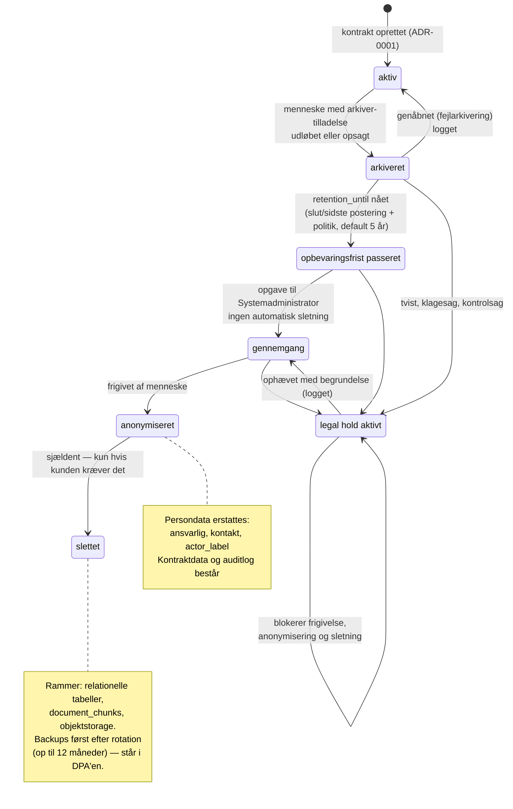

# ADR-0012: Opbevaring, arkivering og legal hold — persondata og kontraktdata skilles ad

- **Status:** Accepted (2026-09-03)
- **Date:** 2026-09-03
- **Area:** auth-access
- **Deciders:** Project owner
- **Related:** ADR-0001 (`status: arkiveret`), ADR-0002 (RLS; afledte tabeller),
  ADR-0003 (`arkiver`-tilladelsen), ADR-0006 (uforanderlige dokumentversioner),
  ADR-0007 (objektstorage, backup-rotation), ADR-0011 (auditloggen kan kun slettes
  herfra); `docs/adr-plan.md` (N10, K04); bidflow ADR-0008 (GDPR-eksport og -sletning),
  ADR-0074 (purge skal også ramme afledte tabeller), ADR-0011 (planlagt purge-kommando)

## Kontekst

Bidflow ADR-0008's model er: soft-delete af organisationen, hard-delete efter 30 dage,
FK-cascade fjerner alt. Den er rigtig for et udbudsværktøj, hvor kundens data er
arbejdsdokumenter.

Den er **forkert** her, og det er K04 i planen. Obliance er kontraktarkivet for en
offentligt ejet indkøbsorganisation. Materialet er:

- **Regnskabsmateriale.** Fakturakontroller, bodsopgørelser, kreditnotakrav og
  betalingsgrundlag er bilag til bogføringen. Dansk bogføringslovgivning kræver
  opbevaring i **5 år fra udgangen af det regnskabsår, materialet vedrører** — den
  præcise afgrænsning af hvad der er "regnskabsmateriale" i vores tabeller skal
  bekræftes af kundens egen rådgiver, ikke af os.
- **Udbudsretlig dokumentation.** Tildelingsgrundlag, standstill, kontraktændringer og
  optionsudnyttelse skal kunne dokumenteres i klage- og kontrolsager, ofte i hele
  kontraktens løbetid plus en periode efter.
- **Bevis i tvister.** En verserende sag om et bodskrav gør sletning af grundlaget
  skadeligt uanset hvad en opbevaringspolitik siger.

Samtidig indeholder materialet **personoplysninger**: kontaktpersoner hos leverandøren,
medarbejdernavne i RACI og på opgaver, underskrivere, brugerkonti. En registreret kan
bede om sletning — og "vi sletter hele kontraktarkivet" er ikke svaret.

Mockuppen har allerede den ene halvdel: `arkiver` er en selvstændig tilladelse (kun
Systemadministrator og Contract Manager har den), og kontraktstatus omfatter
`arkiveret` (ADR-0001). Den anden halvdel — hvad der sker efter arkivering — er ikke
besluttet nogen steder.

## Beslutning

### 1. To datakategorier, to regelsæt

| Kategori | Hvad | Regel |
|---|---|---|
| **Kontraktdata** | kontrakter, dokumentversioner, forpligtelser, KPI'er, risici, fakturaer, SLA-brud, RACI, godkendelser, auditlog | **Bevares** efter opbevaringspolitikken. Slettes ikke på anmodning. |
| **Persondata** | kontaktpersoner, brugerkonti, navne på ansvarlige, underskrivere, e-mailadresser | Slettes eller **pseudonymiseres**, når formålet ophører — også mens kontraktdataene består. |

Nøglen er, at persondata kan **erstattes uden at ødelægge kontraktdataene**: en
forpligtelse beholder sin tekst, sin kilde og sin historik, men "ansvarlig: Ole Kjær"
bliver til "ansvarlig: [slettet bruger #38]". Auditloggens frosne `actor_label`
(ADR-0011) erstattes på samme måde — rækken, handlingen og tidspunktet består.

### 2. Livscyklus for en kontrakt

`aktiv → arkiveret → opbevaringsperiode udløbet → anonymiseret → slettet`

- **Arkivering** kræver `arkiver` (ADR-0003) og er en menneskelig handling: kontrakten
  er udløbet eller opsagt, og der er ikke mere at gøre. Arkiverede kontrakter er
  skrivebeskyttede, udelades af Overblik, pipeline og agentkørsler (ADR-0010), men er
  fuldt søgbare og læsbare — inklusive for copiloten, hvis brugeren spørger til dem.
- **Opbevaringsperioden** beregnes pr. kontrakt: `retention_until = max(slutdato,
  sidste økonomiske postering) + retention_years`, hvor `retention_years` er en
  **politik pr. organisation** (`retention_policies`), default 5 år, som kunden kan
  hæve. Feltet gemmes på kontrakten ved arkivering, så en senere politikændring ikke
  flytter fortidens frister uvarslet.
- **Efter udløb** sker intet automatisk. Der oprettes en **opgave** til
  Systemadministrator: "12 kontrakter har passeret opbevaringsfristen — gennemgå og
  frigiv". Sletning af et kontraktarkiv er ikke et cronjob.
- **Anonymisering før sletning:** persondata erstattes, kontraktdata og auditlog
  består. For de fleste kunder er dette slutstationen — den fulde sletning er sjælden.

### 3. Legal hold står over alt

Tabel **`legal_holds (organization_id, scope, scope_id, reason, placed_by, placed_at,
released_by, released_at)`**, hvor `scope` er `contract`, `supplier` eller `org`.

- Et aktivt hold **blokerer** arkiverings-frigivelse, anonymisering, sletning og
  GDPR-erasure for det, det dækker — håndhævet i selve sletterutinen, ikke kun i UI'et.
- At sætte og ophæve et hold kræver `arkiver` og logges (ADR-0011). Begrundelsen er
  obligatorisk.
- Et hold på en kontrakt dækker automatisk dens dokumentversioner, forpligtelser,
  fakturaer og auditrækker — samme arv som ADR-0002's synlighed.

### 4. GDPR-rettigheder — hvad vi svarer

- **Indsigt og portabilitet:** bidflow ADR-0008's eksport overføres — én ZIP med
  `export.json` (alle org-scopede rækker) plus de originale dokumenter. Uændret god
  beslutning.
- **Sletning (art. 17):** vi sletter **persondata**, ikke kontraktarkivet, og oplyser
  hvorfor: opbevaringen er nødvendig for at overholde en retlig forpligtelse og for at
  fastlægge og forsvare retskrav. Det svar skal stå klar i DPA'en, så det ikke skal
  formuleres under tidspres.
- **En bruger, der fratræder** (bidflow ADR-0067's deaktivering), er ikke en
  sletteanmodning. Kontoen deaktiveres, historikken består; anonymisering sker først
  efter organisationens egen frist for medarbejderdata.
- **Kundeophør:** eksport udleveres, kontoen lukkes, og data bevares i den aftalte
  periode (default 90 dage) inden anonymisering — med legal hold som undtagelse. Det er
  længere end bidflows 30 dage, fordi et kontraktarkiv, der forsvinder, ikke kan
  genskabes fra en anden kilde.

### 5. Sletningen skal ramme alle steder — også dem, cascaden ikke når

Bidflow ADR-0074's dyrekøbte lærdom, oversat til denne stak. En sletning eller
anonymisering skal ramme:

1. Relationelle tabeller (FK-cascade dækker dem, ADR-0001).
2. **Vektorindekset** (`document_chunks`) — nøglet på kontrakt og version, ikke på org
   alene. Ryddes eksplicit.
3. **Objektstorage** (ADR-0007) — dokumentversioner og genererede PDF'er slettes med
   præfiks; slettejobbet verificerer, at bucket'en er tom for præfikset bagefter.
4. **Auditloggen** — den eneste rute til at røre `audit_log` (ADR-0011). Her
   *anonymiseres* der, der slettes ikke: rækken består, aktørnavnet erstattes.
5. **Backups** — og her er den ærlige sætning: **en sletning virker ikke bagud i
   backupsættet.** Data forsvinder først fra off-site-kopierne, når rotationen har
   passeret (ADR-0007: 7 daglige, 4 ugentlige, 12 månedlige — altså op til 12 måneder).
   Det skal stå i DPA'en, ikke opdages af kunden.

Slettejobbet kører som en **særskilt databaserolle** med rettigheder, appen ikke har
(ADR-0011), er idempotent, og logger hvert trin.

## Diagram — livscyklus og det, der blokerer den

Beslutningen har en **tilstandsdimension**: data bevæger sig gennem faser, hver overgang
har en udløser og en gate, og legal hold er en tværgående blokering, der rammer flere
overgange. Det er svært at holde i prosa, fordi de to datakategorier løber ad hver sin
vej gennem samme livscyklus. Sammenligningen af kategorierne (§1) bliver i tabelform;
selve forløbet tegnes.

## Konsekvenser

- **K04 er lukket:** bidflow ADR-0008's "hard delete efter 30 dage" overføres ikke som
  regel for kontraktdata. Eksport-halvdelen overføres uændret.
- **Ingen automatisk sletning nogensinde.** Fristen skaber en opgave, ikke en handling.
  Det er langsommere og rigtigt: en fejl i en politik må ikke kunne slette et
  kontraktarkiv om natten.
- **Anonymisering skal designes ind i skemaet nu**, ikke bagefter: hver tabel med
  persondata skal kunne miste navnet uden at miste rækken. Konkret betyder det, at vi
  ikke må gemme navne som fritekst i `details`-felter, hvor de ikke kan findes igen.
- **Kunden kan hæve, ikke sænke** opbevaringspolitikken under lovkravet — feltet
  valideres mod et minimum, så en kunde ikke ved et uheld sætter 1 år på
  regnskabsmateriale.
- **Backup-forsinkelsen på op til 12 måneder** er en oplysning, der skal frem tidligt i
  en sikkerhedsgennemgang. Den er en konsekvens af ADR-0007's rotationsplan, ikke en
  fejl — men den er en overraskelse, hvis den nævnes for sent.
- Arkiverede kontrakter udelades af agentkørsler (ADR-0010), hvilket også er en
  omkostningsbesparelse: agenterne arbejder kun på den levende portefølje.
- Den juridiske afgrænsning (hvad er regnskabsmateriale, hvor længe skal udbudsretlig
  dokumentation bevares) er **ikke** vores at fastlægge. Vi bygger politikken som data
  og en sikker default; kunden og deres rådgiver sætter tallet.
- Tests/tjek: legal hold blokerer alle fire ruter (frigivelse, anonymisering, sletning,
  GDPR-erasure); anonymisering efterlader kontraktrækker og auditrækker intakte med
  erstattet navn; sletning rydder `document_chunks` og objektstorage-præfikset og
  verificerer tomhed; `retention_until` fryses ved arkivering; app-rollen kan ikke køre
  slettejobbet.

## Alternativer overvejet

- **Bidflows model uændret (soft delete → hard delete efter 30 dage).** Afvist: sletter
  regnskabs- og udbudsdokumentation, som kunden er forpligtet til at bevare, og gør
  produktet ubrugeligt som arkiv.
- **Bevar alt for evigt, slet aldrig.** Afvist: i strid med princippet om
  opbevaringsbegrænsning for persondata, og det gør en sletteanmodning ubesvarlig.
  Tostrengs-modellen er netop svaret på begge hensyn.
- **Automatisk sletning ved fristens udløb.** Afvist: konsekvensen af en fejl er
  irreversibel og rammer materiale, der ikke findes andre steder. En opgave koster et
  klik og fjerner hele klassen af fejl.
- **Slet også i backups ved en sletteanmodning.** Afvist som teknisk urealistisk med
  krypterede, roterende off-site-kopier — og som skadeligt for
  gendannelsesevnen. Løsningen er at oplyse rotationsvinduet, ikke at love noget andet.
- **Én global opbevaringsperiode i kode.** Afvist: Amgros' krav er ikke den næste kundes,
  og et tal i kode kan ikke dokumenteres i en DPA. Politik pr. organisation, seedet med
  en default.
- **Lade legal hold være en note på kontrakten.** Afvist: et hold, der kun findes som
  tekst, holder ikke, når slettejobbet kører. Det skal være en tabel, sletterutinen
  konsulterer.

## Afklaringer (2026-09-03, besluttet af project owner)

1. **Default opbevaringsperiode: 5 år** efter kontraktens ophør, konfigurerbart op pr.
   organisation. Kundens rådgiver sætter det endelige tal i onboardingen.
2. **Arkiverede kontrakter indgår i copilotens svar** — "hvad aftalte vi sidst med denne
   leverandør?" er et af arkivets mest værdifulde spørgsmål, og adgangen er stadig
   rettighedsfiltreret (ADR-0002).
3. **Kundeophør: 90 dages bevaring** før anonymisering (mod bidflows 30). Et
   kontraktarkiv kan ikke genskabes fra en anden kilde, og 90 dage giver tid til en reel
   overdragelse.
