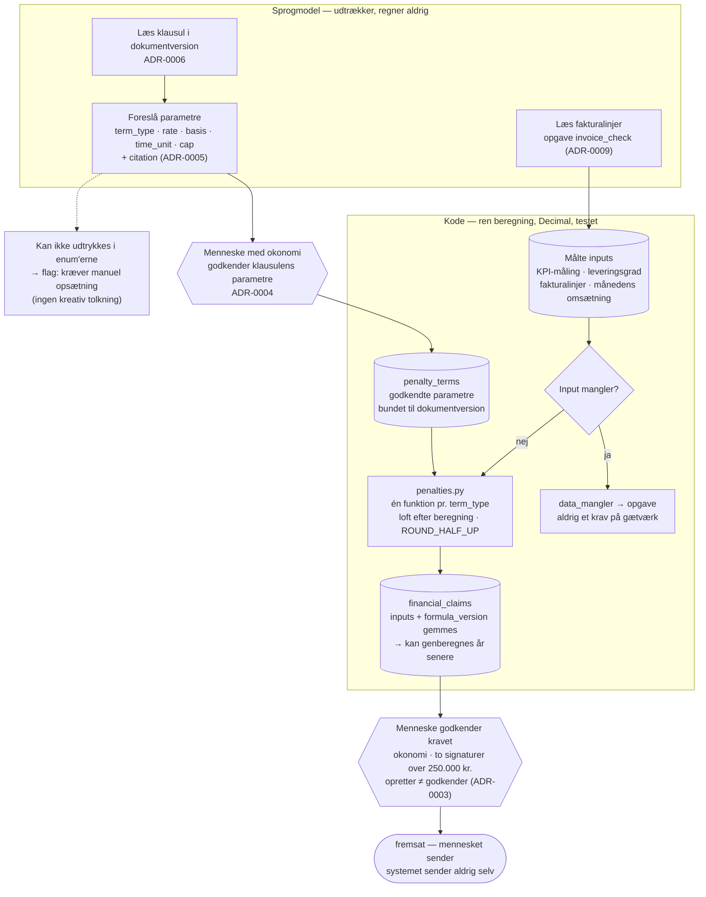

# ADR-0013: Bod, service credits og krav beregnes i kode — modellen udtrækker kun parametre

- **Status:** Accepted (2026-09-03)
- **Date:** 2026-09-03
- **Area:** finance
- **Deciders:** Project owner
- **Related:** ADR-0003 (beløbsgrænser, to signaturer, funktionsadskillelse), ADR-0004
  (parametre er forslag), ADR-0005 (hvert tal har en kilde), ADR-0006 (parametre hører
  til en dokumentversion), ADR-0009 (`invoice_check` udtrækker, beregner ikke),
  ADR-0011 (beløb i auditloggen), ADR-0012 (regnskabsmateriale bevares);
  `docs/adr-plan.md` (N06); kommende ADR om ERP-feed (N11) og KPI-måledata (N19)

## Kontekst

Mockuppen viser beløb, der bliver til pengekrav mod en leverandør:

- **Service credit:** *"Oppetid juli: 99,62 % (krav 99,8 %)"* → **30.625 kr.**, beskrevet
  som *"5 % af månedligt driftsvederlag (612.500 kr.)"*, med kilde `Bilag 5, s. 2,
  tabel 1`.
- **Bod ved leveringssvigt:** *"Ved leveringsgrad under 98,5 % ifalder leverandøren en
  bod på 2 % af værdien af de ikke-leverede ordrelinjer pr. påbegyndt uge, dog maksimalt
  15 % af den pågældende måneds omsætning under aftalen"* (`Rammeaftale, s. 9, pkt. 6.2`).
- **Kreditnotakrav:** en faktura afregnet til 1.211,60 kr./pakning mod aftalt fast AIP på
  1.184,00 kr. → difference **96.512 kr.**, med anbefalingen *"Afvis differencen og
  anmod om kreditnota"* og kilde `Prisbilag, s. 2, tabel 1`.

Det er ikke analyser. Det er beløb, der fremsættes over for en leverandør, indgår i
regnskabsmaterialet (ADR-0012) og kan ende i en tvist. Tre ting følger af det:

1. **En sprogmodel må ikke regne dem ud.** Ikke fordi den regner dårligt, men fordi et
   tal, der ikke kan genberegnes med samme resultat hver gang, ikke kan forsvares. Og
   siden `temperature` ikke længere findes (ADR-0009 §3), kan determinismen slet ikke
   købes på modelsiden.
2. **Grundlaget skal kunne vises.** Mockuppen viser det allerede — "5 % af 612.500 kr."
   — og det er præcis det, en leverandør vil bestride.
3. **Klausulen er en kilde, ikke en hukommelse.** Satsen 2 %, loftet 15 % og tærsklen
   98,5 % står i et bestemt punkt i en bestemt dokumentversion.

Modellen er god til det, kode er dårlig til: at læse *"2 % af værdien af de ikke-leverede
ordrelinjer pr. påbegyndt uge, dog maksimalt 15 %"* og udlede, at der er en sats, en
beregningsbasis, en tidsenhed og et loft. Kode er god til det, modellen er dårlig til: at
gange, runde og gøre det ens hver gang.

## Beslutning

### 1. Klausulens parametre er data, udtrukket som forslag

Tabel **`penalty_terms`** pr. kontrakt, hver række bundet til den `document_version_id`
og den `citation`, den kom fra (ADR-0005/0006):

| Felt | Eksempel (bod) | Eksempel (service credit) |
|---|---|---|
| `term_type` | `delivery_penalty_per_week` | `service_credit_tiered` |
| `trigger` | `leveringsgrad < 98,5 %` | `oppetid < 99,8 %` |
| `rate` | `0.02` | tier: `99,5–99,79 % → 0.05`, `< 99,5 % → 0.10` |
| `basis` | `vaerdi_ikke_leverede_ordrelinjer` | `maanedligt_driftsvederlag` |
| `time_unit` | `paabegyndt_uge` | `maaned` |
| `cap` | `0.15 × maanedens_omsaetning_under_aftalen` | — |
| `citation_id` | Rammeaftale, s. 9, pkt. 6.2 | Bilag 5, s. 2, tabel 1 |

`term_type`, `basis` og `time_unit` er **enums**, ikke fritekst. En klausul, modellen
ikke kan udtrykke i enum'erne, bliver **ikke** et forslag — den bliver et flag:
"klausul kunne ikke struktureres, kræver manuel opsætning". Det er bedre end en
kreativ tolkning, der senere bliver til et forkert krav.

Parametrene ankommer som `ai_suggestions` af `subject_kind: penalty_term` (ADR-0004) og
skal **godkendes af et menneske** med `okonomi`-tilladelsen, før nogen beregning bruger
dem. Godkendelsen sker én gang pr. klausul pr. dokumentversion — ikke pr. krav.

### 2. Beregningen er en ren funktion i kode

`app/finance/penalties.py` indeholder én funktion pr. `term_type`, alle rene:
godkendte parametre + målte inputs ind, `Decimal` ud. Regler:

- **`Decimal`, aldrig `float`.** Pengebeløb i `numeric(14,2)` (ADR-0001).
- **Afrunding:** til hele ører, `ROUND_HALF_UP`, kun ved det endelige beløb — mellemled
  afrundes ikke.
- **Loft anvendes efter beregning**, og både det ubegrænsede og det begrænsede beløb
  gemmes, så det kan ses, at loftet slog til.
- **Manglende input er ikke nul.** Kan `maanedens_omsaetning_under_aftalen` ikke opgøres,
  fejler beregningen med `data_mangler` og bliver til en opgave — ikke til et krav på
  et gætværk. Samme princip som KPI'ernes grå status (N19).
- Hver funktion har **enhedstest med mockuppens egne tal** som første testtilfælde:
  5 % af 612.500 = 30.625; 1.211,60 − 1.184,00 pr. pakning × antal = 96.512.

Registret af `term_type` udvides med en ny funktion + tests, ikke med en prompt.

### 3. Kravet gemmer sit eget grundlag

Tabel **`financial_claims`**, én række pr. krav:

`contract_id`, `claim_type`, `period`, `penalty_term_id`, **`inputs` (JSONB — de
faktiske målte tal)**, `formula_version` (kodeversion af beregningsfunktionen),
`amount_uncapped`, `amount`, `currency = DKK`, `status`, `created_by`, `citations[]`.

`inputs` + `penalty_term_id` + `formula_version` betyder, at ethvert krav kan
**genberegnes** år senere og give samme tal — også efter at koden er ændret, fordi
versionen er gemt. Det er den egenskab, der gør et krav forsvarligt i en tvist, og det
er samme idé som bidflows provenance-rygrad (ADR-0018), anvendt på penge.

`beregningsgrundlag` gengives for brugeren som én linje, sammensat af de samme felter:
*"5 % af månedligt driftsvederlag (612.500,00 kr.) = 30.625,00 kr. — jf. Bilag 5, s. 2,
tabel 1"*. Teksten **genereres af koden**, ikke af modellen.

### 4. Kravets livscyklus og hvem der må hvad

`beregnet → godkendt → fremsat → (modregnet | betalt | afvist_af_leverandoer | frafaldet)`

- **`beregnet`** oprettes af systemet (efter en godkendt måling eller en fakturakontrol)
  og er synligt som "kræver handling".
- **`godkendt`** kræver `okonomi` (ADR-0003) — og **to signaturer over 250.000 kr.**,
  hvoraf den ene skal være Contract Owner. Funktionsadskillelse gælder: den, der
  registrerede grundlaget, kan ikke godkende kravet.
- **`fremsat`** er en menneskelig handling, der markerer, at kravet er sendt.
  **Systemet sender ikke selv noget til leverandøren** — hverken agent, notifikationsmotor
  eller copilot. Udkastet til brevet kan genereres (`draft_letter`, ADR-0009), men
  afsendelsen sker uden for systemet, og det er bevidst: mockuppens egen systemprompt
  forbyder AI'en at afsende meddelelser, og den regel gælder hele produktet.
- **`modregnet`** kobler kravet til den faktura, det modregnes i — mockuppens *"service
  credit for juli (30.625 kr.) bør modregnes på næste faktura"*.
- Hver overgang skriver en auditrække med beløb (ADR-0011) og bevares som
  regnskabsmateriale (ADR-0012).

### 5. Hvad modellen aldrig gør

- Regner. Ganger. Runder af.
- Bestemmer, om en tærskel er overtrådt (det gør en sammenligning i kode mod en målt
  værdi).
- Vælger, hvilken klausul der gælder, når to kunne passe — den foreslår, mennesket
  godkender.
- Sender noget.

Modellen udtrækker parametre, udtrækker fakturalinjer, og skriver udkast til tekst. Det
er tre veldefinerede opgaver med skema (ADR-0009), og de er alle sammen forslag.

## Diagram — grænsen mellem model og kode

Beslutningens kerne er en **ansvarsgrænse**: hvad modellen rører, hvad kode rører, og
hvor mennesket står imellem. Prosaen kan sige det, men et diagram viser, at der er *to*
menneskelige godkendelser (klausulens parametre, og selve kravet) med en ren beregning
imellem — og at ingen pil går fra en model til et beløb.

## Konsekvenser

- **Et krav kan altid forsvares:** grundlaget vises som tekst, kilden kan klikkes, og
  tallet kan genberegnes fra gemte inputs og en gemt formelversion.
- **Nye klausultyper koster kode**, ikke prompt-justering. Det er langsommere og
  meningen: en ny måde at beregne penge på fortjener en test, ikke en formulering.
- **Enum-begrænsningen vil afvise virkelige klausuler** i starten — usædvanlige
  bodsmodeller, trappede satser, klausuler med flere betingelser. De bliver til manuel
  opsætning, og listen over afviste klausuler er den prioriterede backlog for §2's
  register.
- **`formula_version` skal vedligeholdes disciplineret.** Ændres en funktion, må gamle
  krav ikke genberegnes med ny logik. Versionen gemmes pr. krav, og gamle versioner
  slettes aldrig.
- Beregningen er billig og deterministisk, så "genberegn dette krav" bliver en tryg
  knap — nyttig når en måling korrigeres.
- **Systemet sender aldrig et krav.** Det betyder, at der findes et manuelt skridt
  mellem godkendelse og leverandør. Det er en bevidst begrænsning i v1, ikke en mangel
  at lukke senere uden en ny beslutning.
- Renter ved forsinket betaling er **ikke** i v1. Rentesatser og -tidspunkter er et
  eget regelsæt, og et forkert renteberegnet krav er værre end intet renteberegnet krav.
- Tests/tjek: mockuppens tre beløb rammes præcist af de tre funktioner; loft slår til og
  begge beløb gemmes; manglende omsætningstal giver `data_mangler` og ingen række i
  `financial_claims`; et krav over 250.000 kr. kan ikke få status `godkendt` med én
  signatur; genberegning af et gammelt krav med gemt `formula_version` giver samme tal
  efter en ændring af funktionen; ingen sti fra en modelrespons til `amount`.

## Alternativer overvejet

- **Lad modellen beregne og lad mennesket kontrollere** (mockuppens bogstavelige
  fremtoning: agenten præsenterer et færdigt beløb). Afvist: mennesket kontrollerer
  reelt ikke aritmetik, det accepterer den. Og uden `temperature` kan samme spørgsmål
  give to tal — hvilket er umuligt at forsvare over for en leverandør.
- **Beregning i SQL/databasefunktioner.** Afvist: sværere at teste, sværere at versionere
  og umuligt at gemme en `formula_version` for. Python-funktioner med enhedstest er
  det rigtige sted.
- **Fri formel pr. kontrakt (en lille formeleditor).** Afvist for v1: flytter risikoen
  fra modellen til en bruger uden at tilføje test eller versionering. Registret af
  typer med kode og tests er kedeligere og sikrere.
- **Beregn løbende og vis kravet som "potentielt"** uden godkendelse af parametrene.
  Afvist: et beløb i UI'et bliver læst som et beløb, også når der står "foreløbig".
  Parametrene godkendes først.
- **Automatisk modregning i næste faktura.** Afvist: en modregning er en betalingsbeslutning
  med retlige konsekvenser. Systemet foreslår den (som mockuppen gør), et menneske
  udfører den.
- **Renteberegning i v1.** Fravalgt som scope, ikke som idé.

## Afklaringer (2026-09-03, besluttet af project owner)

1. **Godkendte klausulparametre arves automatisk ved `uaendret` citat** (ADR-0005) og
   kræver ny godkendelse ved `flyttet` og `ikke_fundet` — ellers drukner en
   versionsopdatering brugeren i genbekræftelser.
2. **`fremsat` er en separat handling** fra godkendelsen, udført af samme rolle. "Godkendt
   internt" og "sendt til leverandøren" må aldrig være samme klik.
3. **Beregningen kører automatisk**, når en måling godkendes, og opretter et `beregnet`
   krav. Et SLA-brud, ingen opdager, er præcis det, produktet sælges på at fange.

## Implementeringsnote (2026-09-04, første increment)

Bygget: `penalty_terms` (migration 0007) med enum'erne fra §1 (`term_type`, `basis`,
`time_unit`), foreslået af Obligation Extraction Agent i samme kørsel som forpligtelser og
godkendt af `okonomi`; `app/finance/penalties.py` med én ren funktion pr. `term_type`
(`service_credit_pct_of_fee`, `service_credit_tiered`, `delivery_penalty_per_week`,
`fixed_penalty_per_breach`) og `price_deviation` til fakturalinjer, alle `Decimal`,
`ROUND_HALF_UP` kun på slutbeløbet, loft efter beregning med begge beløb gemt,
`DataMissing` frem for nul; `financial_claims` med `inputs`, `formula_version` og
kode-genereret `beregningsgrundlag`, og livscyklussen fra §4 inkl. to signaturer over
250.000 kr. (anden signatur Contract Owner), funktionsadskillelse og `fremsat` som separat
handling. Genberegning findes som endpoint. Fund: mockuppens 96.512 kr. for prisafvigelsen
kan ikke reproduceres af 27,60 kr. × 3.496 (= 96.489,60 kr.); koden er sandheden, tallet i
mockuppen er en trykfejl. Ikke bygget: `approvals`-tabellen som selvstændig tabel
(signaturerne står på kravet), opgaver ved `data_mangler` (venter på `tasks`), renter.
