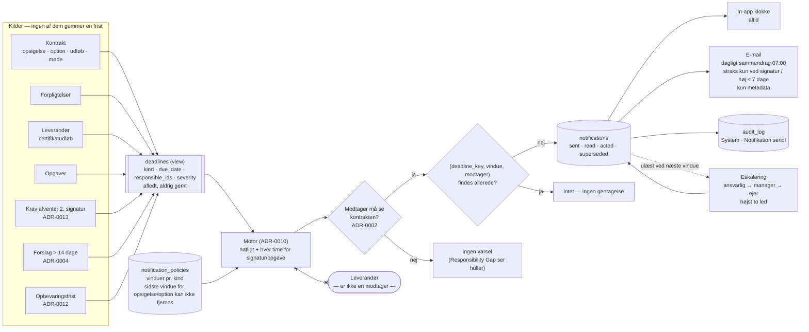

# ADR-0017: Deadline- og notifikationsmotor — frister afledes, varsler dedupliceres, intet sendes til leverandøren

- **Status:** Accepted (2026-09-03)
- **Date:** 2026-09-03
- **Area:** arch
- **Deciders:** Project owner
- **Related:** ADR-0001 (`naeste_deadline` er afledt; `governance_meetings`), ADR-0002
  (modtagere filtreres af synlighed), ADR-0004 (forslag over 14 dage eskaleres),
  ADR-0010 (scheduler, natlig kørsel), ADR-0011 (`Notifikation sendt` i auditloggen),
  ADR-0012 (opbevaringsfrist → opgave), ADR-0013 (`afventer_owner` kræver handling);
  `docs/adr-plan.md` (N12); bidflow ADR-0046 (notifikationer udskudt dengang), ADR-0006
  (mail-backend: console/SMTP/Resend)

## Kontekst

Mockuppens topbar har en notifikationsklokke, og auditloggens øverste række er
`System · Notifikation sendt · Deadline om 30 dage: Varsling af option (K-2023-014)`.
Frister findes overalt i datamodellen, men som forskellige felter på forskellige
entiteter:

| Kilde | Felt | Eksempel |
|---|---|---|
| Kontrakt | `last_termination_date` | senest opsigelse 30-09-2026 |
| Kontrakt | `options[].varsel_senest` | varsling af forlængelsesoption |
| Kontrakt | `end_date` | udløb 31-03-2027 |
| Kontrakt | `governance_meetings[].naeste` | kvartalsvist driftsmøde |
| Forpligtelse | `deadline` | årlig ISAE 3402-erklæring |
| Leverandør | `certifikater[].udloeb` | arbejdsmiljøcertifikat udløbet 05-2026 |
| Opgave | `deadline` | beslutningsoplæg 12-09-2026 |
| Krav (ADR-0013) | status `afventer_owner` | 2. signatur mangler |
| Forslag (ADR-0004) | `created_at` + 14 dage | ubesluttet forslag |
| Arkiv (ADR-0012) | `retention_until` | gennemgang før sletning |

Mockuppens `naesteDeadline` på kontrakten er den nærmeste af dem — og ADR-0001 besluttede,
at den **ikke gemmes**, fordi et gemt felt bliver forældet. Det samme gælder varsler: et
varsel, der er sendt ud fra en dato, som siden er ændret, er værre end intet varsel.

Bidflow udskød notifikationer helt (ADR-0046). Her er de ikke valgfrie: mockuppens
værdiløfte er, at *"en frist, ingen opdager"* ikke sker.

## Beslutning

### 1. Én afledt fristkø, ingen gemt fristtabel

`deadlines` er et **view** (eller en materialiseret forespørgsel, der genopbygges
natligt), ikke en tabel med egne rækker. Det samler alle kilderne ovenfor til én form:

`(organization_id, contract_id, kind, subject_kind, subject_id, due_date, label,
responsible_ids[], severity)`

- `kind` er en lukket enum: `opsigelse · option · udloeb · moede · forpligtelse ·
  certifikat · opgave · signatur · forslag · opbevaring`.
- `responsible_ids` udledes pr. kind: forpligtelsens ansvarlige, kontraktens manager og
  ejer, RACI's A og R for aktiviteten, Contract Owner for `signatur`, Systemadministrator
  for `opbevaring`.
- `severity` udledes af kind og kritikalitet: en N1-kontrakts optionsvarsel er `hoej`;
  et driftsmøde er `lav`.

Ændres en dato på kilden, ændres fristen næste gang viewet læses. Der er intet at
synkronisere.

### 2. Varslingsvinduer pr. kind, som politik

Tabel **`notification_policies (organization_id, kind, windows_days[], channels[])`**,
seedet med defaults:

| kind | vinduer (dage før) | begrundelse |
|---|---|---|
| `opsigelse`, `option` | 180, 90, 30, 7 | et opsigelsesvarsel på 6 måneder kræver et beslutningsoplæg måneder før |
| `udloeb` | 365, 180, 90 | genudbud tager et år |
| `certifikat` | 90, 30, 0 | 0 = udløbet i dag |
| `forpligtelse` | 30, 7, 0, −7 | −7 = en uge over tid |
| `opgave` | 7, 1, 0 | |
| `moede` | 14, 2 | Meeting Preparation Agent skal have tid |
| `signatur` | 0, 3, 7 | fra det øjeblik 2. signatur mangler, derefter påmindelse |
| `forslag` | 14, 30 | ADR-0004's eskalering |
| `opbevaring` | 30 | ADR-0012's gennemgang |

Kunden kan ændre vinduerne, men ikke fjerne det sidste vindue for `opsigelse` og
`option` — en kontrakt, der forlænges automatisk, fordi ingen blev varslet, er præcis
det, produktet skal forhindre.

### 3. Deduplikering: ét varsel pr. (frist, vindue, modtager)

Tabel **`notifications (organization_id, recipient_id, deadline_key, window_days,
channel, sent_at, read_at, acted_at)`**, hvor `deadline_key` = hash af
`(kind, subject_kind, subject_id, due_date)`.

- Motoren (en natlig ADR-0010-kørsel plus en hurtig kørsel hver time for `signatur` og
  `opgave`) beregner for hver frist i viewet, hvilke vinduer der er passeret, og
  opretter en notifikation **kun hvis** `(deadline_key, window_days, recipient)` ikke
  allerede findes.
- **Ændres `due_date`, ændres nøglen** → nye varsler for den nye dato, og de gamle
  markeres `superseded`. Det er den ønskede adfærd: en flyttet frist er en ny frist.
- Ingen frist varsler samme person mere end én gang pr. vindue. Støj er den hurtigste
  måde at få folk til at slå notifikationer fra.

### 4. Kanaler

- **In-app** (klokken): altid. Ulæste tælles; klik navigerer til objektet (mockuppens
  `go`). Læst/handlet registreres.
- **E-mail**: efter politikken, som **dagligt sammendrag kl. 07:00** som default — én mail
  med dagens frister sorteret efter severity. Kun `signatur` og `severity = hoej` med
  vindue ≤ 7 dage sendes **straks**. Mailen indeholder kontraktreference, fristtype og
  dato — **aldrig dokumentindhold, beløb eller fortrolige kontraktnavne** (ADR-0007 §6:
  mail forlader miljøet med metadata alene).
- Brugeren kan vælge sammendrag fra og straks-mails til, men ikke slå `signatur` og
  `opsigelse`/`option` fra i in-app.

**Der findes ingen kanal til leverandøren.** Notifikationsmotoren har ikke leverandørens
e-mail som mulig modtager, hverken nu eller som konfiguration. Mockuppens systemprompt
forbyder AI'en at afsende meddelelser; ADR-0013 fastslår, at systemet aldrig sender
et krav. Denne ADR lukker den sidste vej: heller ikke en "venlig påmindelse" går ud af
huset automatisk.

### 5. Modtagere filtreres af synlighed

En notifikation om en fortrolig kontrakt oprettes kun for modtagere, der må se den
(ADR-0002). Motoren kører i systemkontekst, men slår hver modtagers adgang op, før
rækken skrives. Konsekvens: en frist på en fortrolig kontrakt uden aktive adgangshavere
varsler ingen — og det er en tilstand, Responsibility Gap Agent rapporterer.

### 6. Eskalering

Et varsel, der er `sent` men hverken `read` eller `acted` ved næste vindue, eskaleres til
næste led: forpligtelsens ansvarlige → kontraktens manager → kontraktens ejer.
Eskaleringen er en ny notifikation med `escalated_from`, ikke en gentagelse. Der er
højst to eskaleringsled; derefter står fristen som "kræver handling" på ejerens
Overblik, og det er dét.

## Diagram — fra ti kilder til én klokke

Beslutningen har en **strukturdimension** (fan-in fra ti kilder til én kø) og en
**procesdimension** (vinduer, deduplikering, kanalvalg, eskalering). Prosaen kan liste
kilderne og reglerne; den viser dårligt, at alt løber gennem ét view og én
dedupliering, og at leverandøren ikke er en modtager. Tabellerne (§2) bliver tabeller;
flowet tegnes.

## Konsekvenser

- **Mockuppens `naesteDeadline` og klokken bliver sande** uden en eneste gemt frist —
  ændrer nogen en dato, følger varslerne med, og de gamle superseder sig selv.
- **Et view over ti kilder er en tung forespørgsel.** Ved hundreder af kontrakter pr. org
  er det stadig millisekunder; ved tusinder materialiseres det natligt. Beslutningen er
  taget nu, så ingen bygger en fristtabel "midlertidigt".
- **Dagligt sammendrag som default** betyder, at en frist, der opstår kl. 08:00, først
  mailes næste morgen — medmindre den er `signatur` eller høj/≤ 7 dage. Det er
  bevidst: kontraktstyring tåler et døgn, og en indbakke gør ikke.
- **Ingen leverandørkanal** betyder, at påmindelser til leverandøren er en manuel
  handling. Det er en begrænsning, kunden vil spørge til, og svaret er ADR-0013's: det,
  der går ud af huset, skal et menneske have sendt.
- Eskalering kræver, at manager og ejer er sat (ADR-0001's nullable felter). Er de ikke,
  stopper eskaleringen ved det led, der findes — og hullet er allerede en
  Responsibility Gap-finding.
- Politikken pr. org betyder, at Administration får endnu en tabel at redigere. Den
  seedes med defaults, så ingen kunde skal konfigurere noget for at få varsler.
- Tests/tjek: en flyttet `due_date` giver nye varsler og superseder de gamle; samme
  frist varsler samme person én gang pr. vindue; en fortrolig kontrakt varsler ikke en
  bruger uden adgang; leverandørens e-mail kan ikke optræde som modtager (skema-
  begrænsning, ikke kun UI); sammendraget indeholder ingen beløb eller dokumentindhold;
  `opsigelse`-politikken kan ikke gemmes uden sit sidste vindue.

## Alternativer overvejet

- **Gem frister i en tabel, når kilden ændres (triggere).** Afvist: ADR-0001's argument —
  afledte felter bliver forældede, og ti kilder giver ti steder, hvor en trigger kan
  mangle. Et view kan ikke være ude af sync.
- **Ét varsel pr. dag, indtil fristen er håndteret.** Afvist: støj. Folk slår
  notifikationer fra, og så virker ingen af dem.
- **Straks-mail for alt.** Afvist: samme grund. Sammendraget er default; straks er
  reserveret til det, der ikke kan vente et døgn.
- **Konfigurerbar leverandørkanal ("kunden kan slå den til").** Afvist: en konfiguration,
  der findes, bliver slået til. Grænsen skal være i skemaet, ikke i en indstilling.
- **Ekstern notifikationstjeneste (push, SMS).** Fravalgt for v1: e-mail og in-app dækker
  et kontorværktøj; SMS ville tilføje en underdatabehandler for lav værdi.
- **Lade agenterne sende varsler selv.** Afvist: varsler er systemets, ikke AI'ens.
  Motoren er deterministisk og bruger ingen model.

## Afklaringer (2026-09-03, besluttet af project owner)

1. **Dagligt sammendrag kl. 07:00 lokal tid er default** for e-mail. Klokken ses kun af
   dem, der er logget ind; fristerne rammer også dem, der ikke er.
2. **Eskalering efter ét ubesvaret vindue.** Vinduerne er allerede spredt, så "næste
   vindue" er uger senere, ikke dagen efter.
3. **`moede`-frister vækker Meeting Preparation Agent** (ADR-0010's hændelsesdrevne
   kørsel) 14 dage før, så agendaudkastet ligger klar. Det er formålet med, at governance
   blev struktureret i ADR-0001.

## Implementeringsnote (2026-09-04, første udsnit)

Fristkøen fra §1 findes som afledt forespørgsel i `GET /api/dashboard` med fire af de ti
`kind`-værdier: `opsigelse` (`last_termination_date`), `udloeb` (`end_date`),
`forpligtelse` (åbne forpligtelsers `deadline`) og `risiko`. `severity` udledes af
kontraktens niveau (N1/N2 → høj) og forpligtelsens kritikalitet. Intet gemmes; en
ændret dato på kilden ændrer fristen næste gang, den læses. Varslingsvinduer,
notifikationer, eskalering og de øvrige kinds (option, møde, certifikat, opgave,
signatur, forslag, opbevaring) er ikke bygget.
