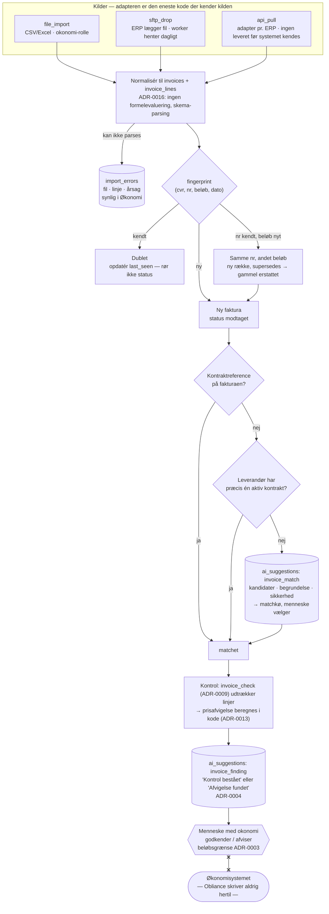

# ADR-0018: ERP-integration — indgående fakturafeed, idempotent, aldrig tilbageskrivning

- **Status:** Accepted (2026-09-03)
- **Date:** 2026-09-03
- **Area:** integration
- **Deciders:** Project owner
- **Related:** ADR-0001 (`forbrug` afledes af godkendte fakturaer; `invoices` som barn),
  ADR-0003 (`okonomi`; fakturaafvisning under beløbsgrænsen), ADR-0004 (kontrolresultat
  er et forslag), ADR-0005 (`record`-citations til fakturalinjer), ADR-0009
  (`invoice_check` udtrækker), ADR-0010 (kørsel når feeden lander), ADR-0013
  (prisafvigelse beregnes i kode), ADR-0016 (importfiler er ikke-betroet input);
  `docs/adr-plan.md` (N11)

## Kontekst

Mockuppen viser tre ting om økonomi-integrationen:

1. **En feed.** `ERP-1 … ERP-5` med `ts, nr, kontraktId, leverandor, beloeb, agent, status`,
   status `Under AI-kontrol · Afvigelse fundet · Godkendt af AI, afventer bogføring`, og
   auditrækken `System · ERP-integration · Fakturaer synkroniseret · 3 nye fakturaer
   modtaget fra økonomisystemet`. Overblikket viser *"ERP-integration · Forbundet ·
   Sidste synkronisering i dag kl. 09.12"*.
2. **Linjeniveau.** Kontrollen sammenligner *"37 farmaceuttimer faktureret til 590 kr./t"*
   mod *"aftalt pris 545 kr./t i dagtimer, jf. rammeaftalens pkt. 6.2"* og *"3.496
   pakninger afregnet til 1.211,60 kr."* mod *"aftalt fast AIP 1.184,00 kr."*. Det kræver
   fakturalinjer, ikke kun et totalbeløb.
3. **En manuel vej.** Tom-tilstanden siger *"Importér fakturadata fra Excel eller CSV i
   økonomimodulet."*

Det er også synligt, hvad mockuppen *ikke* siger: hvilket ERP-system Amgros bruger, og om
noget nogensinde skal skrives tilbage. Én status i mockuppen er direkte i strid med
ADR-0004: **"Godkendt af AI, afventer bogføring"** — AI godkender ikke noget, og
Obliance bogfører ikke noget. Den formulering skal væk.

Kravet er derfor: fakturaer skal kunne komme ind ad flere veje, matches til en kontrakt,
gemmes på linjeniveau, kontrolleres mod prisgrundlaget, og aldrig importeres to gange
— uden at systemet nogensinde rører økonomisystemets egen bogføring.

## Beslutning

### 1. Indgående, aldrig udgående — i v1 og som princip

Obliance **læser** fakturaer. Det skriver ikke tilbage: ingen godkendelse i ERP'et,
ingen bogføring, ingen betalingsfrigivelse, ingen kreditnota oprettet i økonomisystemet.
Resultatet af en kontrol er et **forslag** (ADR-0004), som et menneske godkender i
Obliance, og som det menneske derefter handler på i økonomisystemet.

Det er ikke kun en v1-afgrænsning. En tilbageskrivning ville gøre Obliance til en del
af kundens betalingsflow med alt, hvad det kræver af revision og funktionsadskillelse på
tværs af to systemer. Skulle det komme, er det en ny ADR med en ny risikoprofil.

### 2. Én model, flere kilder

Tabel **`invoice_sources (organization_id, kind, config, enabled, last_sync_at,
last_sync_status)`**, hvor `kind` er en adapter:

| kind | v1 | Hvordan |
|---|---|---|
| `file_import` | **ja** | CSV/Excel uploadet af en bruger med `okonomi`; fast kolonneskema med dansk Excel-format (semikolon, komma-decimal) |
| `sftp_drop` | **ja** | ERP'et lægger en fil i en SFTP-mappe (Hetzner-hostet, ADR-0007); worker henter dagligt |
| `api_pull` | adapter-interface | én adapter pr. ERP-system; ingen konkret leveret før kundens system er kendt |

Alle tre ender i **samme normaliserede form** før noget andet sker. Adapteren er den
eneste kode, der kender kilden; resten af systemet kender kun `invoices` og
`invoice_lines`.

Overblikkets *"Forbundet · sidste synkronisering"* er `last_sync_at` + `last_sync_status`
på kilden. "Forbundet" betyder "seneste kørsel lykkedes inden for kildens forventede
kadence" — ikke "der findes en konfiguration".

### 3. Fakturaer og linjer

**`invoices`** (barn af kontrakten, ADR-0001, nullable `contract_id` indtil matchet):
`source_id`, `supplier_id`, `invoice_number`, `invoice_date`, `due_date`, `currency`,
`total_amount`, `external_ref` (kildens eget id), `fingerprint`, `status`, `matched_by`
(`reference · rule · suggestion · manual`), `raw_payload` (JSONB — det, kilden sendte,
til fejlsøgning; ryddes efter ADR-0012).

**`invoice_lines`**: `line_no`, `description`, `quantity`, `unit`, `unit_price`,
`line_total`, `period_from/to`, `product_ref`. Linjerne er det, prisgrundlaget
sammenlignes med (ADR-0013), og det, `record`-citations peger på (ADR-0005:
`invoice/10493/linje 3`).

### 4. Idempotens: en faktura importeres én gang

`fingerprint = sha256(supplier_cvr, invoice_number, total_amount, invoice_date)`. Regler:

- Samme fingerprint igen → **opdatér** `raw_payload` og `last_seen_at`, rør ikke status.
  En genkørsel af en fil eller et dobbelt SFTP-drop er ufarligt.
- Samme `invoice_number` fra samme leverandør med **andet** beløb → **ny** række med
  `supersedes_invoice_id`, og den gamle markeres `erstattet`. Det er en kreditnota eller
  en rettet faktura, ikke en dublet — og den skal kontrolleres igen.
- Import sker i én transaktion pr. fil/batch med en rapport: modtaget, nye, opdaterede,
  erstattede, afviste (med årsag).

### 5. Matchning til kontrakt — tre trin, sidste trin er et forslag

1. **Reference:** fakturaen bærer kontraktreferencen (`K-2023-014`) eller
   `contract_number` (ADR-0001) i et kendt felt → match, `matched_by = reference`.
2. **Regel:** leverandør har præcis **én** aktiv kontrakt i perioden → match,
   `matched_by = rule`.
3. **Forslag:** flere kandidater eller ingen sikker → `ai_suggestions` af `subject_kind:
   invoice_match` (ADR-0004) med kandidater, begrundelse og sikkerhed; agenten
   `invoice_check` (ADR-0009) læser linjeteksterne mod kontrakternes beskrivelser.
   Fakturaen står i **matchkøen** i Økonomi, indtil et menneske vælger.

Umatchede fakturaer kontrolleres ikke — der er intet prisgrundlag at kontrollere mod.
De tælles på Overblikket som "fakturaer uden kontrakt".

### 6. Kontrollen og dens statusser

Kontrollen (ADR-0013's `price_deviation_claim` og ADR-0009's `invoice_check`) kører, når
en faktura er matchet, og skriver et **forslag**, ikke en status. Fakturaens egen status
er kun det, der er sket med den:

`modtaget → matchet → kontrolleret → (godkendt | afvist | erstattet)`

Mockuppens *"Godkendt af AI, afventer bogføring"* bliver **"Kontrol bestået — klar til
godkendelse"**: kontrollen fandt ingen afvigelse, og et menneske med `okonomi` godkender
med ét klik. *"Afvigelse fundet"* beholdes, med forslagets anbefaling ved siden af. Hvad
der derefter sker i økonomisystemet, ved Obliance ikke og viser ikke.

### 7. Fejlkø og sikkerhed

- Rækker, der ikke kan parses (manglende felter, ugyldig dato, ukendt leverandør-CVR),
  ender i **`import_errors`** med filreference, linjenummer og årsag — synlige i Økonomi
  for `okonomi`-rollen, aldrig tabt i en log.
- Importfiler er **ikke-betroet input** (ADR-0016): Excel læses uden formelevaluering,
  celler behandles som tekst/tal efter skemaet, filstørrelse og rækkeantal er begrænset,
  og filen gemmes i objektstorage (ADR-0007) som bevis for, hvad der blev importeret.
- Ukendt leverandør-CVR opretter **ikke** en leverandør automatisk — det er en
  fejlkø-post, fordi en leverandør er stamdata med governance (N16).

## Diagram — fra kilde til forslag

Beslutningen har en **procesdimension** med tre indgange, der samles til ét spor, en
idempotens-forgrening (ny, dublet, erstatning), en tretrins matchning, og et endepunkt,
der er et forslag frem for en handling. Prosaen kan beskrive hvert trin; den viser
dårligt, at alle kilder deler samme spor, og at pilen ud af systemet mod ERP'et ikke
findes.

## Konsekvenser

- **Kunden får fakturakontrol uden integrationsprojekt:** CSV/Excel og SFTP virker fra
  dag 1. En rigtig API-adapter bygges, når kundens ERP er kendt — mod et interface, der
  allerede findes.
- **"Godkendt af AI" forsvinder fra UI'et.** Det er en konflikt med mockuppen, og den
  løses til fordel for ADR-0004. Et menneske godkender; AI'en har kontrolleret.
- **Ingen tilbageskrivning** betyder et manuelt skridt mellem "godkendt i Obliance"
  og "bogført". Det er samme grænse som ADR-0013 (systemet sender ikke) og ADR-0017
  (leverandøren er ikke modtager): det, der har økonomisk virkning uden for systemet,
  udføres af et menneske.
- Linjeniveau gør datamængden større (tusindvis af linjer pr. måned for en stor
  rammeaftale). Det er nødvendigt: uden linjer er "afregnet til 1.211,60 kr. pr. pakning"
  ikke kontrollérbart.
- `raw_payload` er bevis og fejlsøgning, men også dobbelt lagring. Det ryddes efter
  ADR-0012's politik — ikke straks, fordi en tvist om en faktura kan komme sent.
- `forbrug` pr. år på kontrakten (ADR-0001) afledes af fakturaer med status `godkendt`.
  Fakturaer i matchkøen tæller ikke — de kan ikke tilskrives en kontrakt endnu.
- Tests/tjek: samme fil importeret to gange giver nul nye rækker; samme fakturanummer
  med nyt beløb giver `erstattet` + ny række; en faktura uden reference og med to
  mulige kontrakter ender i matchkøen, ikke i en kontrakt; en Excel med formel
  importeres som tekst, ikke som evalueret værdi; ukendt CVR ender i `import_errors` og
  opretter ingen leverandør; der findes ingen kode-sti, der kalder en ERP-skrive-endpoint.

## Alternativer overvejet

- **Tovejs-integration ("godkend i Obliance, bogfør automatisk").** Afvist: gør
  produktet til en del af kundens betalingsflow med revisionskrav på tværs af to
  systemer. Kan komme som egen ADR med egen risikoprofil.
- **Kun API-integration, ingen filimport.** Afvist: blokerer piloten på kundens
  IT-afdeling. Filer virker på dag 1 og er, hvad mockuppen selv foreslår.
- **Kun totalbeløb, ingen linjer.** Afvist: mockuppens kontroller er linjeniveau, og
  ADR-0013's prisafvigelse kan ikke beregnes på en total.
- **Automatisk oprettelse af ukendte leverandører ved import.** Afvist: en leverandør er
  stamdata med certifikater, performance og RACI-rolle (N16); en importfejl må ikke
  oprette den i forbifarten.
- **Match altid via AI-forslag (spring reference og regel over).** Afvist: 80–90 % af
  fakturaerne bærer en reference eller har én mulig kontrakt; at bede en model om det
  er langsommere, dyrere og mindre sikkert end en opslagsregel.
- **Slet `raw_payload` straks efter import.** Afvist: "hvad stod der faktisk i filen?" er
  det første spørgsmål i en tvist om en faktura.

## Afklaringer (2026-09-03, besluttet af project owner)

1. **`sftp_drop` er med i v1.** Det er den billigste integration, de fleste
   økonomiafdelinger kan levere uden et projekt, og den kører på infrastruktur, vi
   allerede har (ADR-0007).
2. **Statusnavnet er "Kontrol bestået — klar til godkendelse".** Det siger, hvorfor
   fakturaen er klar, og skelner den fra en manuelt oprettet.
3. **En faktura i matchkøen i mere end 14 dage eskaleres** via ADR-0017 som kind
   `opgave` på Finance Controller. En faktura uden kontrakt er en faktura, ingen
   kontrollerer.
