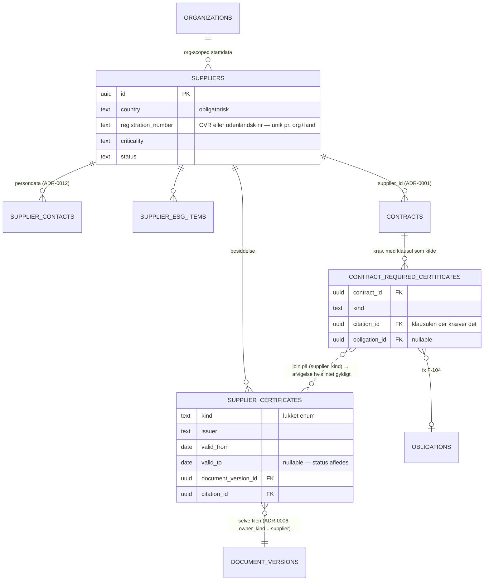

# ADR-0020: Leverandørstamdata — certifikater som data, scorer som afledning med synligt grundlag

- **Status:** Accepted (2026-09-03)
- **Date:** 2026-09-03
- **Area:** arch
- **Deciders:** Project owner
- **Related:** ADR-0001 (leverandør er stamdata på tværs af kontrakter), ADR-0004
  (krav til certifikater udtrækkes som forslag), ADR-0005 (certifikatet er et dokument
  med kilde), ADR-0006 (dokumentversionering — udvides med leverandør som ejer),
  ADR-0009 (`cert_extract` på Haiku; `supplier_summary`), ADR-0012 (kontaktpersoner er
  persondata), ADR-0017 (kind `certifikat`), ADR-0018 (ukendt CVR opretter aldrig en
  leverandør), ADR-0019 (KPI-status indgår i performance); `docs/adr-plan.md` (N16);
  bidflow ADR-0077 (CVR-berigelse — overføres ikke)

## Kontekst

Mockuppens leverandører: `navn, cvr, kategori, kritikalitet, kontakt, performance (71),
compliance (86), certifikater[], esg, note`. Certifikaterne er **strenge**:

- `"ISO 27001 (gyldig til 03-2027)"`, `"ISAE 3402 type II (2025)"`
- `"GMP (EMA, 2025)"`, `"GDP-certifikat (gyldig til 06-2027)"`
- `"Arbejdsmiljøcertifikat (udløbet 05-2026)"` — og leverandørens `compliance: 68` og
  noten *"Manglende fornyet arbejdsmiljøcertifikat – complianceafvigelse åben"*
- `"Fødevarekontrol: Elite-smiley"`

ESG er også strenge (*"EcoVadis Sølv 2026"*, *"CO2-rapportering modtaget for 2025"*,
*"Ikke modtaget"*). To agenter arbejder på dem: **Compliance Agent** (*"Overvåger GMP/GDP-
certifikater, erklæringer og lovpligtig dokumentation"*) og **Supplier Performance
Agent** (*"Samler leverandørperformance på tværs af leverancer, afvigelser og klager"*).

Tre ting er tydelige:

1. **En streng med en dato i kan ikke overvåges.** "gyldig til 03-2027" skal være en
   dato, ellers kan ingen agent varsle udløb, og ADR-0017's `certifikat`-frist har intet
   at læse.
2. **Scorerne `performance: 71` og `compliance: 86` er tal, brugerne vil tro på** — og
   bruge i leverandørmøder. Kommer de ud af ingenting, er de farligere end ingen tal.
3. **Kravet om et certifikat står i en kontrakt** (*"Gyldigt arbejdsmiljøcertifikat"* er
   forpligtelse F-104 med kilde `Rammeaftale, s. 15, pkt. 12.1`), mens certifikatet
   holdes af **leverandøren** på tværs af kontrakter. "Ikke modtaget" er en *forskel*
   mellem krav og besiddelse — ikke et felt.

Og en afgrænsning fra planen: bidflow ADR-0077's CVR-berigelse (opslag i CVR-registret)
overføres ikke. CVR er en nøgle her, ikke en datakilde.

## Beslutning

### 1. Leverandøren er org-scoped stamdata med registreringsnummer som nøgle

**`suppliers`** (RLS niveau 1; ingen niveau 2 — en leverandør er ikke fortrolig, dens
kontrakter kan være det): `name`, `country` (ISO), **`registration_number`** (CVR for
DK; VAT-/organisationsnummer for udenlandske), `category`, `criticality` (`lav · mellem ·
hoej`), `note`, `status` (`aktiv · inaktiv`).

- **Unik pr. (organization_id, country, registration_number).** Dansk CVR valideres på
  format (8 cifre, modulus 11-kontrol); udenlandske numre kun på ikke-tomhed. Ingen
  opslag i eksterne registre — leverandøren oprettes af et menneske med `kontraktRed`,
  aldrig af en import (ADR-0018 §7).
- Pharma-leverandørerne i mockuppen (Nordic Biopharm, Scanmed) og EU-udbud generelt gør
  udenlandske leverandører til normalen, ikke undtagelsen. `country` er obligatorisk.

**`supplier_contacts`**: `name`, `role`, `email`, `phone`, `is_primary`. **Persondata**
(ADR-0012) — anonymiserbare uden at røre leverandøren. Mockuppens `kontakt: "Peter
Lindqvist, Key Account Manager"` er én sådan række, ikke en streng på leverandøren.

### 2. Certifikater er dokumenter med gyldighed — ikke strenge

**`supplier_certificates`**: `supplier_id`, **`kind`** (lukket enum, udvides ved
migration: `iso_27001 · iso_9001 · iso_14001 · isae_3402 · gmp · gdp · arbejdsmiljoe ·
foedevarekontrol · ecovadis · andet`), `issuer`, `reference`, **`valid_from`,
`valid_to`** (nullable for certifikater uden udløb), `document_version_id` (ADR-0006 —
selve certifikatet som fil), `citation_id` (ADR-0005), `entered_by`, `note`.

- Status er **afledt**: `gyldig` (`valid_to` ≥ i dag + 90 dage), `udloeber_snart`
  (inden for 90 dage), `udloebet`, `uden_udloeb`. Ingen kolonne.
- **Udløb varsles** via ADR-0017's kind `certifikat` (90, 30, 0 dage) — det er præcis det,
  ADR-0017's enum allerede har plads til.
- Certifikatfiler uploades **på leverandøren**, ikke på en kontrakt: ADR-0006's
  dokumentmodel udvides med en ejer-diskriminator (`owner_kind: contract | supplier`),
  samme versionering, samme ingest. Synlighed for leverandørdokumenter er org-niveau
  (`intern`) — et ISO-certifikat er ikke fortroligt.
- `cert_extract` (ADR-0009, Haiku) læser en uploadet certifikat-PDF og **foreslår**
  `(kind, issuer, valid_from, valid_to)` som `ai_suggestions` (ADR-0004) med citation.
  Et menneske godkender; datoen, der udløser en frist, kommer aldrig direkte fra en model.

### 3. "Ikke modtaget" er forskellen mellem krav og besiddelse

**`contract_required_certificates`**: `contract_id`, `kind`, `citation_id` (klausulen,
der kræver det — mockuppens `Rammeaftale, s. 15, pkt. 12.1`), `obligation_id` (nullable —
den forpligtelse, der allerede findes for det, som F-104).

Compliance Agent's arbejde er to ting, og kun den første bruger en model:

1. `obligation_extract` (ADR-0009) finder klausuler af typen "leverandøren skal til enhver
   tid have gyldigt X" og **foreslår** en `contract_required_certificates`-række.
2. **Kode** joiner krav mod besiddelse pr. leverandør: for hver (kontrakt, kind) findes
   der et certifikat af den kind med status `gyldig` eller `udloeber_snart`? Nej →
   **compliance-afvigelse** `(contract_id, supplier_id, kind, since)` — mockuppens
   *"complianceafvigelse åben"*. Den vises på leverandøren, på kontrakten og som
   opgave til kontraktens manager.

En afvigelse lukkes, når et gyldigt certifikat af rette kind registreres — automatisk,
fordi den er afledt. Der er ingen "luk afvigelse"-knap; man uploader certifikatet.

### 4. Scorer er afledte, versionerede og viser deres grundlag

`performance` og `compliance` gemmes aldrig. De beregnes i kode med en **navngiven,
versioneret formel** (samme disciplin som ADR-0013's `formula_version`), og vises
altid med grundlaget ved siden af tallet:

**Compliance (0–100)** pr. leverandør, aggregeret over aktive kontrakter:

| Komponent | Vægt | Kilde |
|---|---|---|
| Krævede certifikater, der er gyldige | 40 | §3 |
| Leverandørens forpligtelser leveret til tiden (seneste 12 mdr.) | 40 | `obligations` med `part = leverandoer` |
| Ingen åbne risici i kategori `GDPR` / `Compliance` med `hoej` konsekvens | 20 | `risks` |

**Performance (0–100)** pr. leverandør:

| Komponent | Vægt | Kilde |
|---|---|---|
| Andel grønne KPI'er (gul tæller halvt, grå tæller ikke) | 40 | ADR-0019 |
| Ingen SLA-brud seneste 6 mdr. (lineært aftagende) | 30 | `sla_breaches` |
| Andel fakturaer uden afvigelse (seneste 12 mdr.) | 20 | ADR-0018 |
| Ingen åbne krav mod leverandøren | 10 | ADR-0013 |

Visningen er *"Performance 71 — 3 af 4 KPI'er grønne · 1 SLA-brud i juli · 2 af 14
fakturaer med afvigelse · 1 åbent krav"*. Tallet uden sætningen findes ikke i UI'et.

Vægtene er **konfiguration pr. installation** med defaults — ikke pr. kunde i v1. En
kunde, der vil have sin egen vægtning, får den som en bevidst ændring, ikke som en
indstilling, der drifter.

**Supplier Performance Agent** er derfor primært **SQL**: den beregner, hvad ovenstående
kræver. Modellen (`supplier_summary`, Haiku) skriver kun det korte resumé
(*"Gentagne SLA-brud på svartider i 2. kvartal 2026"*) ud fra de beregnede tal — som
forslag til noten, ikke som notens indhold. Restordrer, klager og afvigelser er data i
KPI'er, forpligtelser og fakturaer; agenten opfinder ingen af dem.

### 5. ESG som datapunkter

**`supplier_esg_items`**: `kind` (`ecovadis · co2_rapport · miljoemaerke · andet`),
`year`, `status` (`modtaget · ikke_modtaget · ikke_kraevet`), `value` (fx "Sølv"),
`document_version_id`, `citation_id`. Mockuppens tre strenge bliver tre rækker; "Ikke
modtaget" er en status, der kan filtreres på, ikke en tekst.

ESG indgår **ikke** i compliance-scoren i v1 — kravene varierer for meget mellem
kontrakter til én vægt. De vises, de kan kræves pr. kontrakt (samme mønster som §3),
og de kan komme ind i scoren, når en kunde beder om det.

## Diagram — krav mod besiddelse

Beslutningens ikke-oplagte struktur er, at **kravet** hænger på kontrakten (med en
klausul som kilde), **besiddelsen** hænger på leverandøren (med et dokument som kilde),
og "ikke modtaget" opstår i joinet mellem dem. Det er en datadimension, prosaen
beskriver i tre afsnit, og et erDiagram viser på ét ark. Scorerne (§4) er tabeller og
bliver det.

## Konsekvenser

- **Certifikatudløb bliver en frist**, ikke en note nogen skal huske at læse.
  Mockuppens *"arbejdsmiljøcertifikat (udløbet 05-2026)"* ville have varslet 90, 30 og 0
  dage før — og afvigelsen ville have været åben fra dag 1 efter udløb.
- **Scorer med synligt grundlag** er mindre imponerende end et rent tal og mere
  brugbare i et leverandørmøde. Det er en bevidst nedtoning af mockuppens udtryk.
- Formlerne vil blive diskuteret — det er meningen. Vægtene er data, versionerede, og
  en ændring er en synlig beslutning, ikke en stille justering.
- ADR-0006 udvides med `owner_kind` på dokumenter. Det er en lille amendment; den skrives
  ind i 0006 som opdatering, ikke som ny ADR.
- Udenlandske leverandører uden CVR er førsteklasses. Det koster en `country`-kolonne og
  en mindre streng validering — og det er, hvad et EU-udbudsmiljø kræver.
- Ingen CVR-berigelse betyder, at navn, adresse og branche indtastes manuelt. Ved
  hundreder af leverandører er det en overkommelig engangsindsats; ved tusinder er
  bidflow ADR-0077's mønster tilgængeligt som tilføjelse.
- Tests/tjek: samme registreringsnummer i samme land i samme org afvises; certifikat med
  `valid_to` om 60 dage er `udloeber_snart` og har en frist i ADR-0017's view; en
  kontrakt, der kræver `arbejdsmiljoe`, og en leverandør uden gyldigt et, giver en
  afvigelse, der lukker automatisk ved upload og godkendelse af et gyldigt; scoren
  ændres, når en KPI skifter farve, og grundlagsteksten følger med; `cert_extract`-
  forslag med uverificeret kilde vises med advarsel; en anonymiseret kontakt efterlader
  leverandøren intakt.

## Alternativer overvejet

- **Certifikater som strenge (mockuppens model).** Afvist: kan ikke varsles, ikke
  joines mod krav, ikke tælles i en score.
- **Gem scorerne og opdatér dem natligt.** Afvist: ADR-0001's princip; en score, der er
  et døgn gammel efter et SLA-brud, er forkert i det møde, hvor den bruges.
- **Lad Supplier Performance Agent vurdere scoren (modelbaseret).** Afvist: et tal, der
  bruges over for en leverandør, skal kunne genberegnes og forklares — samme argument som
  ADR-0013. Modellen skriver resuméet, ikke tallet.
- **CVR-berigelse fra dag 1 (bidflow ADR-0077).** Afvist: udenlandske leverandører har
  intet CVR, og opslaget tilføjer en ekstern afhængighed for data, et menneske alligevel
  verificerer.
- **Certifikater på kontrakten i stedet for på leverandøren.** Afvist: et ISO 27001-
  certifikat gælder leverandøren, ikke aftalen; det ville skulle uploades én gang pr.
  kontrakt og udløbe fem steder.
- **ESG i compliance-scoren.** Fravalgt for v1: kravene er for forskellige på tværs af
  kontrakter til én vægt; kan tilføjes, når en kunde definerer dem.

## Afklaringer (2026-09-03, besluttet af project owner)

1. **Leverandørkritikalitet afledes som default** af højeste `tier` blandt aktive
   kontrakter (N1 → høj), med manuel overstyring. En leverandør med én N1-kontrakt er
   automatisk kritisk.
2. **Vægtene i §4 er startpunktet**, med udtrykkelig forventning om justering efter
   piloten — enhver justering som en versioneret formelændring.
3. **`inaktiv` kræver, at ingen kontrakt er i `aktiv_drift`.** Ellers afvises
   statusskiftet med en liste over kontrakterne.
