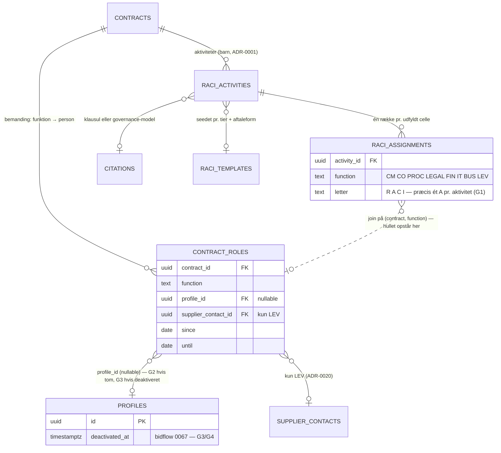

# ADR-0021: RACI som data — funktioner i matricen, personer pr. kontrakt, huller som regler

- **Status:** Accepted (2026-09-03)
- **Date:** 2026-09-03
- **Area:** arch
- **Deciders:** Project owner
- **Related:** ADR-0001 (`owner_id`, `manager_id`, `governance_meetings`), ADR-0003
  (`raciGodkend`; roller ≠ funktioner), ADR-0004 (RACI-forslag med sikkerhedsniveau),
  ADR-0005 (aktivitetens kilde), ADR-0009 (Responsibility Gap og Workload uden model;
  `raci_design` på Opus), ADR-0010 (natlig kørsel), ADR-0017 (`responsible_ids` fra RACI),
  ADR-0020 (LEV = leverandørkontakt); `docs/adr-plan.md` (N17); bidflow ADR-0067
  (deaktivering, ikke sletning)

## Kontekst

Mockuppens *Ansvar og governance* viser en RACI-matrix pr. kontrakt: rækker er
**aktiviteter** (`Godkende AI-udtræk af forpligtelser`, `Følge op på leveringsgrad og
SLA`, `Beregne og fremsætte bod ved leverancesvigt`, `Fakturakontrol mod prisbilag`,
`Beslutte forlængelse af rammeaftalen`, `Opfølgning på restordrer i patientkritiske uger`),
hver med `kritikalitet`, `kilde` (en klausul eller `Governance-model N1`) og `status`.
Kolonnerne er **otte funktioner**: `CM, CO, PROC, LEGAL, FIN, IT, BUS, LEV` — og LEV er
leverandøren selv.

Tre ting i mockuppens data er værd at se nøje på:

1. Aktivitet **RA-6** (*restordrer i patientkritiske uger*) har `CO: ""` — **ingen A** —
   og to R'er (CM og BUS). Det er præcis den slags hul, Responsibility Gap Agent skal
   finde, og mockuppen indeholder det, formentlig uden at det er tilsigtet.
2. Kolonnerne er **funktioner, ikke personer.** "CM" er ikke Stefán Holm; det er den, der
   er Contract Manager *for denne kontrakt*. Personen findes et andet sted: `manager: "sh"`
   på kontrakten. Hullet "fratrådt medarbejder" (Ole Kjær, `status: "Fratrådt"`) opstår
   dermed i koblingen mellem funktion og person — ikke i matricen.
3. **RACI Design Agent** foreslår fordelingen *"med begrundelse og sikkerhedsniveau"* og
   godkendes af en rolle med `raciGodkend`; **Responsibility Gap Agent** finder
   *"aktiviteter uden ansvarlig"* og fratrådte; **Workload & Capacity Agent** *"analyserer
   arbejdsbelastning pr. medarbejder og foreslår omfordeling"* (mockuppens kode flager
   over 15 kontrakter pr. person). ADR-0009 besluttede, at de to sidste **ikke bruger en
   model**.

Kravet er derfor en datamodel, hvor matricen kan valideres, hvor funktion og person er
adskilt, og hvor hullerne kan findes med regler — plus én agent, der foreslår, og et
menneske, der godkender.

## Beslutning

### 1. Matricen normaliseres — ingen JSON-celler

**`raci_activities`** (barn af kontrakten): `name`, `criticality`, `citation_id`
(ADR-0005: klausulen eller `record`-citation til governance-modellen), `status`
(`godkendt · foreslaaet`), `template_key` (nullable — se §4).

**`raci_assignments`**: `activity_id`, **`function`** (lukket enum `CM · CO · PROC · LEGAL
· FIN · IT · BUS · LEV`), **`letter`** (`R · A · C · I`). Én række pr. udfyldt celle;
tomme celler findes ikke som rækker.

Normaliseringen er det, der gør resten muligt: "aktiviteter uden A" er én forespørgsel,
"alle aktiviteter hvor FIN er R" er én forespørgsel, og en ændring af én celle er én
auditrække (ADR-0011).

**Valideringsregler** (håndhævet i servicelaget ved godkendelse, ikke kun i UI'et):

- **Præcis ét A** pr. aktivitet. Ikke nul, ikke to.
- **Mindst ét R.**
- `LEV` kan være `R`, `C` eller `I` — aldrig `A`. Leverandøren er ansvarlig for at
  levere, ikke for kundens beslutninger.
- En funktion har højst ét bogstav pr. aktivitet.

Mockuppens RA-6 ville ikke kunne godkendes i den tilstand. Det er rigtigt.

### 2. Funktioner får personer pr. kontrakt

**`contract_roles`**: `contract_id`, `function`, `profile_id` (nullable), `supplier_contact_id`
(nullable — kun for `LEV`), `since`, `until`. Præcis én aktiv person pr. (kontrakt, funktion)
— nogle funktioner kan stå tomme, og det er et hul (§3), ikke en fejl i skemaet.

- ADR-0001's `owner_id` og `manager_id` **er** rækkerne for `CO` og `CM`. De beholdes som
  kolonner af hensyn til forespørgsler og RLS-auto-adgang (ADR-0002), og servicelaget
  holder dem identiske med `contract_roles` — én kilde til sandhed, to læseveje.
- `LEV` peger på en `supplier_contacts`-række (ADR-0020), aldrig på en `profiles`-række.
  Leverandørens kontakt er ikke en bruger.
- `PROC`, `LEGAL`, `FIN` vil ofte være samme person på tværs af mange kontrakter
  (afdelingens ene jurist). Det er tilladt og er præcis det, Workload måler (§5).

Funktion og RBAC-rolle (ADR-0003) er **ikke** samme ting: en person med rollen
`Contract Manager` kan være `CM` på ti kontrakter og `BUS` på en ellevte. Rollen giver
rettigheder; funktionen giver ansvar for en bestemt kontrakt. ADR-0017's
`responsible_ids` læses fra `contract_roles`, ikke fra rollen.

### 3. Ansvarshuller er regler — ingen model

Responsibility Gap Agent (ADR-0009: ingen model; ADR-0010: natlig) kører følgende
regler og skriver hvert fund som `ai_suggestions` af `subject_kind: task` med
`actor_label = System · Responsibility Gap` (ADR-0009's afklaring 3):

| # | Regel | Eksempel fra mockuppen |
|---|---|---|
| G1 | Godkendt aktivitet uden `A` | RA-6 |
| G2 | Aktivitet hvor en funktion har `A` eller `R`, men `contract_roles` har ingen aktiv person for funktionen på kontrakten | `FIN: R` på fakturakontrol, ingen Finance Controller tilknyttet |
| G3 | Person i `contract_roles` er **deaktiveret** (bidflow ADR-0067) | Ole Kjær, fratrådt 30-06-2026, stadig `CM` på 4 kontrakter |
| G4 | Forpligtelse, risiko eller opgave med `ansvarlig` = deaktiveret person | F-104's ansvarlige |
| G5 | Fortrolig kontrakt uden aktive adgangshavere (ADR-0002/0017 §5) | — |
| G6 | Kontrakt i `aktiv_drift` uden `CM` eller uden `CO` | — |
| G7 | Aktivitet med `kritikalitet = hoej`, hvor `A` og `R` er samme funktion **og** den funktion er tom | — |

Fundene er **dedupliceret** med ADR-0004's fingerprint (regel + objekt), så en nat med
samme hul ikke giver en ny opgave. Et lukket hul (person tilknyttet, A sat) lukker
opgaven automatisk næste kørsel — den er afledt.

Hvert fund foreslår en **konkret handling**, ikke kun en diagnose: *"Ole Kjær er
fratrådt. 4 kontrakter mangler Contract Manager: K-2023-014, … — foreslået: Stefán Holm
(har 6 kontrakter, samme afdeling)"*. Forslaget om *hvem* kommer fra §5's tal, ikke fra
en model. Et menneske med `raciGodkend` tildeler.

### 4. RACI Design Agent foreslår — ud fra skabelon og klausuler

`raci_design` (ADR-0009, Opus) kører ved kontraktoprettelse og ved ny gældende version
(ADR-0006) og foreslår **aktiviteter med fordeling**, som `ai_suggestions` af
`subject_kind: raci_entry` med `confidence` og `rationale` — mockuppens *"begrundelse og
sikkerhedsniveau"*. Grundlaget er to ting:

1. **Skabeloner pr. `tier` og `agreement_form`** (`raci_templates`, seedet): en N1-
   rammeaftale får som udgangspunkt aktiviteterne *SLA-opfølgning*, *bodsberegning*,
   *fakturakontrol*, *forlængelsesbeslutning*, *leverandørmøder* — med en default-fordeling.
   Skabelonen er data, ikke prompt, og kan redigeres af Systemadministrator.
2. **Klausuler**, der pålægger kunden noget (varsling, godkendelse, kontrol): modellen
   foreslår en aktivitet med `citation_id`, som ADR-0005 verificerer.

Modellen foreslår aldrig **personer** — kun funktioner. Personer tildeles af mennesker i
`contract_roles`. Og modellen ser aldrig, hvem der er fratrådt eller overbelastet; det er
§3 og §5.

Godkendelse kræver `raciGodkend` (ADR-0003: Contract Manager, Contract Owner, Legal &
Compliance, Systemadministrator) og validerer §1's regler — et forslag, der bryder
"præcis ét A", kan ikke godkendes uden rettelse.

### 5. Arbejdsbelastning er en optælling

Workload & Capacity Agent (ingen model) beregner pr. aktiv bruger:

- kontrakter som `CM` og som `CO` (vægtet med `tier`: N1 = 3, N2 = 2, N3–N4 = 1)
- åbne forpligtelser og opgaver som `ansvarlig`
- ubesluttede forslag i kø hos personen (ADR-0004)

Tærskel pr. organisation (`workload_policies`, default: vægtet kontraktsum > 30 eller > 15
kontrakter som CM — mockuppens tal). Over tærsklen → én `task`-suggestion til
Systemadministrator og personens leder (CO på flest af kontrakterne): *"Signe Brandt er
FIN på 22 kontrakter; foreslået flytning af 4 N3-kontrakter til …"*. Kandidaten er den
med lavest vægtet sum i samme rolle. **Ingen omfordeling sker automatisk.**

Tallene vises også på personen i Administration — for `brugere`-tilladelsen og for
personen selv.

### 6. Meeting Preparation Agent læser matricen

Ved et `moede` (ADR-0017's afklaring 3) henter `meeting_prep` (ADR-0009, Sonnet)
deltagerne fra `governance_meetings` (ADR-0001) og de aktiviteter, hvor mødets
deltagerfunktioner er `A` eller `R`, plus åbne forpligtelser, krav og forslag på
kontrakten. Agendaudkastet er et forslag af `subject_kind: task` — et dokument, et
menneske redigerer. `C` og `I` på relevante aktiviteter foreslås som "til orientering".

## Diagram — funktioner, personer og hvor hullerne opstår

Beslutningens ikke-oplagte struktur er **adskillelsen** af matricen (aktivitet ×
funktion) fra bemandingen (kontrakt × funktion → person), og at hullerne G1–G7 opstår
tre forskellige steder: i matricen (intet A), i bemandingen (tom funktion) og i
personen (deaktiveret). Det er en datadimension, prosaen beskriver i tre afsnit; et
erDiagram viser de tre steder på ét ark. Reglerne (§3) og vægtene (§5) er tabeller.

## Konsekvenser

- **Mockuppens RA-6 er et fund, ikke en fejl i produktet.** Validering ved godkendelse
  ville have stoppet den; Responsibility Gap ville have fundet den, hvis den var sluppet
  igennem. Det er et godt demo-eksempel, netop fordi det står i mockuppens egne data.
- **Fratrådte medarbejdere bliver synlige samme nat**, fordi G3/G4 læser
  `deactivated_at` — bidflow ADR-0067's beslutning om at deaktivere frem for at slette
  er forudsætningen; en slettet profil ville have efterladt tomme felter uden navn.
- **Tre agenter uden model** (Gap, Workload, og bemandings-delen af RACI Design) er
  deterministiske, billige og genkørbare. De hedder stadig agenter i UI'et (ADR-0009's
  afklaring 3) og bruger samme forslagsflow.
- `owner_id`/`manager_id` som spejl af `contract_roles` er redundans med en invariant.
  Alternativet — at fjerne kolonnerne fra ADR-0001 — ville røre en accepteret ADR og
  RLS-auto-adgangen i ADR-0002 for lidt gevinst.
- Skabeloner pr. tier gør RACI-forslagene forudsigelige og redigérbare uden prompt-
  ændringer. De er også der, hvor en kunde tilpasser sin governance-model — som data.
- Workload-tærskler vil ramme rigtige mennesker med rigtige lederrelationer. Forslaget
  går til Systemadministrator og lederen, ikke til personen selv som første modtager —
  det er en ledelsesbeslutning, ikke en notifikation.
- Tests/tjek: en aktivitet uden A kan ikke godkendes; to A'er kan ikke; `LEV: A` afvises;
  deaktivering af en profil giver G3-fund næste kørsel for hver af personens
  kontraktfunktioner og G4 for hver åben forpligtelse; et lukket hul lukker opgaven
  automatisk; samme hul to nætter i træk giver én opgave; `raci_design`-forslag
  indeholder aldrig et `profile_id`; en person over workload-tærsklen giver én opgave
  med en navngiven kandidat.

## Alternativer overvejet

- **JSON-celler pr. aktivitet (mockuppens `cells: {CM: "R", …}`).** Afvist: kan ikke
  valideres, forespørges eller auditlogges pr. celle; "aktiviteter uden A" ville kræve
  at læse hele tabellen i applikationen.
- **Personer direkte i matricen** (kolonner = medarbejdere). Afvist: matricen ville
  skulle omskrives ved hver personaleændring, og funktionen "hvem er CM på denne
  kontrakt" ville drukne i navne. Funktion → person pr. kontrakt er den standard, RACI
  bygger på.
- **Lad RACI Design Agent foreslå personer.** Afvist: modellen kender ikke belastning,
  fravær eller fratrædelse, og en fejl her rammer en navngiven medarbejder. Personer er
  §5's tal og et menneskes valg.
- **Responsibility Gap med model ("vurdér om ansvaret er dækket").** Afvist: G1–G7 er
  forespørgsler; en model ville gøre dem langsommere, dyrere og ikke-deterministiske
  (ADR-0009).
- **Automatisk omfordeling ved overbelastning.** Afvist: at flytte ansvar for en
  N1-kontrakt er en ledelsesbeslutning. Agenten foreslår, med en kandidat.
- **Tillad `LEV: A`.** Afvist: kunden kan ikke gøre leverandøren ansvarlig for kundens
  egne beslutninger og kontroller; det er præcis den forvirring, RACI skal fjerne.

## Afklaringer (2026-09-03, besluttet af project owner)

1. **Validering gælder både manuel redigering og godkendelse af forslag.** En ugyldig
   matrix er ugyldig uanset forfatter; UI'et viser fejlen inline.
2. **Tier-vægtning i workload (N1 = 3, N2 = 2, N3–N4 = 1)** som default, konfigurerbart
   i `workload_policies`.
3. **G3-fund foreslår en kandidat automatisk** — laveste belastning i samme funktion og
   afdeling. Et menneske vælger stadig; uden kandidat er fundet en diagnose uden handling.

## Implementeringsnote (2026-09-04, første increment)

Bygget (migration 0009): `raci_activities` + `raci_assignments` (én række pr. udfyldt
celle), `contract_roles` (én aktiv person pr. funktion; CO/CM spejles til
`owner_id`/`manager_id`, og kontraktoprettelse spejler den anden vej), `raci_templates`
seedet globalt pr. niveau og aftaleform, `workload_policies` med defaults fra afklaring
2, og `tasks` som mål for `task`-forslag. §1's regler håndhæves i servicelaget ved
oprettelse, celleændring og godkendelse af forslag (afklaring 1); et ugyldigt forslag kan
rettes af mennesket i selve godkendelsen (`payload_overrides`). RACI Design Agent
(`raci_design`, Opus) læser skabeloner som datablok plus aftalegrundlaget og foreslår
aktiviteter med funktioner — aldrig personer. Responsibility Gap kører G1–G7 som regler
uden model med fingerprint pr. (regel, objekt), auto-lukker forsvundne huller og foreslår
kandidat ved G3 (laveste belastning i samme funktion; "samme afdeling" er ikke modelleret
endnu, afklaring 3). Workload & Capacity tæller som §5 og foreslår en kandidat over
tærsklen. Ikke bygget: natlig kørsel (venter på ADR-0010's scheduler — agenterne køres
manuelt bag `agenter`), `supplier_contacts` for LEV (fri tekst indtil ADR-0020), Meeting
Preparation Agent (§6), ADR-0017's `responsible_ids` fra `contract_roles`.

